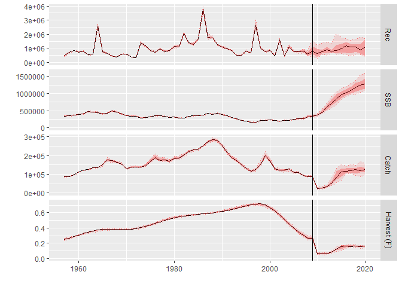

An\_introduction\_to\_MSE\_with\_FLR
================
16 February, 2017

Management Strategy Evaluation (MSE) is a framework for evaluating the performance of Harvest Control Rules (HCRs) against prevailing uncertainties (Punt et al. 2016). This tutorial introduces the basic steps for building a single-species MSE: conditioning the operating model, setting up the observation error model, constructing a simple model-based HCR (based on the ICES MSY approach), performing the MSE simulations (including feedback), and producing performance statistics.

Required packages
-----------------

To follow this tutorial you should have installed the following packages:

-   CRAN: [ggplot2](https://cran.r-project.org/web/packages/ggplot2/index.html)
-   FLR: [FLCore](http://www.flr-project.org/FLCore/), [FLash](http://www.flr-project.org/FLCore/),[FLXSA](http://www.flr-project.org/FLCore/),[FLBRP](http://www.flr-project.org/FLCore/), [ggplotFL](http://www.flr-project.org/ggplotFL/)

You can do so as follows,

``` r
install.packages(c("ggplot2"))
install.packages(c("FLa4a","FLash","FLXSA","FLBRP","ggplotFL"), repos="http://flr-project.org/R")
```

``` r
# This chunk loads all necessary packages, trims pkg messages
library(FLa4a)
library(FLash)
library(FLXSA)
library(FLBRP)
library(ggplotFL)
```

CONDITIONING THE OPERATING MODEL
================================

Conditioning the operating model is a key step in building an MSE analysis, as it allows operating models to be considered "plausible" in the sense that they are consistent with observed data. In this tutorial, the a4a assessment model is fitted to the data within the ple4 FLStock and ple4.index FLIndex objects to produce stk, the operating model FLStock object. An mcmc method withing the a4a assessment is used to obtain parameter uncertainty, reflected in the iter dimension of stk.
**Read in stock assessment data**

``` r
data(ple4)
data(ple4.index)
stk <- ple4; rm("ple4")
idx <- FLIndices(idx=ple4.index); rm("ple4.index")
```

**Set up the iteration and projection window parameters**
In this tutorial, 20 iterations are used along with a 12-year projection window. A 3-year period is used for to calculate averages needed for projections (e.g. mean weights, etc.)

``` r
it <- 20 # iterations
y0 <- range(stk)["minyear"] # initial data year
dy <- range(stk)["maxyear"] # final data year
iy <- dy+1  # initial year of projection (also intermediate)
fy <- dy+12 # final year
ny <- fy - iy + 1 # number of years to project from intial year
nsqy <- 3 # number of years to compute status quo metrics
```

**Fit stock assessment model a4a**
Set up the operating model (including parameter uncertainty) based on fitting the a4a assessment model to data. Reference points are obtained for a "median" stk (stk0) to mimic best estimates of reference points used in the ICES MSY approach.

``` r
qmod <- list(~s(age, k=6))
fmod <- ~ te(replace(age, age>9,9), year, k=c(6,8))
mcmc <- 2000
mcsave <- mcmc / it  #this needs to be an integer value
fit <- a4aSCA(stk, idx, fmodel=fmod, qmodel=qmod, fit="MCMC", mcmc = SCAMCMC(mcmc = mcmc, mcsave = mcsave, mcprobe = 0.4))
stk <- stk + fit
stk0 <- qapply(stk, iterMedians) #reduce to keep one iteration only
```

**Fit stock-recruit model**
A Beverton-Holt stock-recruit model is fitted for each iteration, with residuals generated for the projection window. A stock-recruit model is also fitted to the "median" stk for reference points.

``` r
srbh <- fmle(as.FLSR(stk, model="bevholt"), method="L-BFGS-B", lower=c(1e-6, 1e-6), upper=c(max(rec(stk)) * 3, Inf))
srbh0 <- fmle(as.FLSR(stk0, model="bevholt"), method="L-BFGS-B", lower=c(1e-6, 1e-6), upper=c(max(rec(stk)) * 3, Inf))
srbh.res <- rnorm(it, FLQuant(0, dimnames=list(year=iy:fy)), c(apply(residuals(srbh), 6, mad)))
```

**Calculate reference points and set up the operating model for the projection window**
Reference points based on the "median" stk, assuming (for this tutorial) that Bpa=0.5Bmsy. The stf method is applied to the operating model stk object in order to have the necessary data (mean weights, etc.) for the projection window.

``` r
brp <- brp(FLBRP(stk0, srbh0))
Fmsy <- c(refpts(brp)["msy","harvest"])
Bpa <- 0.5*c(refpts(brp)["msy","ssb"])
stk <- stf(stk, fy-dy, nsqy, nsqy)
```

SET UP OBSERVATION ERROR MODEL ELEMENTS
=======================================

**Estimate the index catchabilities from the a4a fit (without simulation)**
Observation error is introduced through the index catchability-at-age by...
THIS CODE TO BE CLEANED UP TO MAKE IT MORE EFFICIENT AND SUCCINCT. NOT HAPPY WITH THIS.

``` r
idcs <- FLIndices()
for (i in 1:length(idx)){
    lst <- mcf(list(idx[[i]]@index, stock.n(stk0)))
    idx.lq <- log(lst[[1]]/lst[[2]]) # log catchability of index
    idx.qmu <- idx.qsig <- stock.n(iter(stk,1)) # empty quant
    idx.qmu[] <- yearMeans(idx.lq) # Every year has the same mean catchability
    idx.qsig[] <- log((sqrt(yearVars(idx.lq))/yearMeans(idx.lq))^2 + 1) # Every year has same sd
    idx.q <- FLQuant(NA, dimnames=dimnames(stock.n(stk)))
    idx.q[,ac(dimnames(stock.n(stk))$year[1]:dy)] <- propagate(exp(idx.lq[,ac(dimnames(stock.n(stk))$year[1]:dy)]), it)
    idx.q <- rlnorm(it, idx.qmu, idx.qsig) # Build FLQ of index catchability based on lognormal distribution with mean and sd calculated above
    idx_temp <- idx.q * stock.n(stk)
    idx_temp <- FLIndex(index=idx_temp, index.q=idx.q) # generate initial index
    range(idx_temp)[c("startf", "endf")] <- c(0, 0)
    idcs[[i]] <- idx_temp
}
names(idcs) <- names(idx)
idx<-idcs[1]
```

SET UP MSE LOOP
===============

Needed Functions
----------------

IS THERE A BETTER WAY OF DEALING WITH THESE FUNCTIONS?

**Observation error model**
In this tutorial, observation error is applied to the operating model population numbers to obtain an index of abundance. This is implemented through the index catchability-at-age. Observation error is added during each year of the projection window, and is therefore dealt with more easily in a function.

``` r
o <- function(stk, idx, assessmentYear, dataYears) {
    # dataYears is a position vector, not the years themselves
    stk0 <- stk[, dataYears]
    # add small amount to avoid zeros
    catch.n(stk0) <- catch.n(stk0) + 0.1
    # Generate the indices - Just data years
    idx0 <- lapply(idx, function(x) x[,dataYears])
  # Generate objserved index
    for (i in 1:length(idx)) index(idx[[i]])[, assessmentYear] <- stock.n(stk)[, assessmentYear]*index.q(idx[[i]])[, assessmentYear]
  list(stk=stk0, idx=idx0, idx.om=idx)
}
```

**XSA assessment model**
The assessment model used to parameterise the HCR is FLXSA {ref}. This function sets the control parameters for FLXSA and fits the assessment.

``` r
xsa <- function(stk0, idx0){
  # Use default XSA settings
    control  <- FLXSA.control(tol = 1e-09, maxit=99, min.nse=0.3, fse=2.0,
                              rage = -1, qage = stk0@range["max"]-1, shk.n = TRUE, shk.f = TRUE,
                              shk.yrs = 5, shk.ages= 5, window = 100, tsrange = 99, tspower = 0)
  # Fit XSA
  fit0 <- FLXSA(stk0, idx0, control)
  # convergence diagnostic (quick and dirty)
  maxit <- c("maxit" = fit0@control@maxit)
  # Update stk0
  stk0   <- transform(stk0, harvest = fit0@harvest, stock.n = fit0@stock.n)
  return(list(stk0 = stk0, converge = maxit))
}
```

**Control object for projections**
The fwd method {ref} needs a control object, which is set by this function.

``` r
getCtrl <- function(values, quantity, years, it){
    dnms <- list(iter=1:it, year=years, c("min", "val", "max"))
    arr0 <- array(NA, dimnames=dnms, dim=unlist(lapply(dnms, length)))
    arr0[,,"val"] <- unlist(values)
    arr0 <- aperm(arr0, c(2,3,1))
    ctrl <- fwdControl(data.frame(year=years, quantity=quantity, val=NA))
    ctrl@trgtArray <- arr0
    ctrl
}
```

MSE initialisation
------------------

The first year of the projection window is the intermediate year, for which, following the ICES WG timeline, already has a TAC. For this tutorial, the TAC in the final year of data is assumed to be the realised catch in stk, while the TAC in the intermediate year is set equal to the TAC in the final year of data. The stk object then needs to be projected through the intermediate year by applying the TAC in the intermediate year with fwd.

``` r
vy <- ac(iy:fy)
TAC <- FLQuant(NA, dimnames=list(TAC="all", year=c(dy,vy), iter=1:it))
TAC[,ac(dy)] <- catch(stk)[,ac(dy)]
TAC[,ac(iy)] <- TAC[,ac(dy)] #assume same TAC in the first intermediate year
ctrl <- getCtrl(c(TAC[,ac(iy)]), "catch", iy, it)
stk <- fwd(stk, control=ctrl, sr=srbh, sr.residuals = exp(srbh.res), sr.residuals.mult = TRUE)
```

Start the MSE loop
------------------

The MSE loop requires the observation error model to be applied to generate the index of abundance, the stock assessment (XSA) to be appled usint this index to generate the management procedure stock object stk0, the resultant SSB estimate to be used in the HCR, along with the reference points obtained earlier, to derive target Fs for the TAC year (the year after the intermediate year), and the TAC associated with the target F to be calculated by applying fwd to the stk0. The final step of the MSE loop is to apply the TAC to the operating model stock object, stk, by using fwd.
CHANGE stk0 TO mp AND stk TO om.

``` r
for(i in vy[-length(vy)]){
  # set up simulations parameters
    ay <- an(i)
    cat(i, " > ")
    vy0 <- 1:(ay-y0) # data years (positions vector) - one less than current year
    sqy <- (ay-y0-nsqy+1):(ay-y0) # status quo years (positions vector) - one less than current year

  # apply observation error
    oem <- o(stk, idx, i, vy0)
    stk0 <- oem$stk
    idx0 <- oem$idx
    idx <- oem$idx.om

  # perform assessment
  out.assess <- eval(call("xsa", stk0, idx0))
  stk0 <- out.assess$stk0
  
  # apply ICES MSY-like Rule to obtain Ftrgt
  flag <- ssb(stk0)[,ac(ay-1)]<Bpa
  Ftrgt <- ifelse(flag,ssb(stk0)[,ac(ay-1)]*Fmsy/Bpa,Fmsy) 

  # project the perceived stock to get the TAC for ay+1
  fsq0 <- yearMeans(fbar(stk0)[,sqy]) # Use status quo years defined above
  ctrl <- getCtrl(c(fsq0, Ftrgt), "f", c(ay, ay+1), it)
  stk0 <- stf(stk0, 2)
  gmean_rec <- c(exp(yearMeans(log(rec(stk0)))))
  stk0 <- fwd(stk0, control=ctrl, sr=list(model="mean", params = FLPar(gmean_rec,iter=it)))
  TAC[,ac(ay+1)] <- catch(stk0)[,ac(ay+1)]

  # apply the TAC to the operating model stock
  ctrl <- getCtrl(c(TAC[,ac(ay+1)]), "catch", ay+1, it)
  stk <- fwd(stk, control=ctrl,sr=srbh, sr.residuals = exp(srbh.res), sr.residuals.mult = TRUE)
}
```

PERFORMANCE STATISTICS
======================

IAGO TO INSERT PERFORMANCE STATISTICS AND PLOTS

``` r
plot(stk)+geom_vline(aes(xintercept=as.numeric(ISOdate(iy,1,1))))
```


<p class="caption">
Figure 1. Operating model results for applying an ICES MSY-like rule
</p>

References
==========

Punt, A.E., Butterworth, D.S., de Moor, C.L., De Oliveira, J.A.A. and M. Haddon (2016). Management Strategy Evaluation: Best Practices. Fish and Fisheries, 17(2): 303-334. DOI: 10.1111/faf.12104.

More information
================

-   You can submit bug reports, questions or suggestions on this tutorial at <https://github.com/flr/doc/issues>.
-   Or send a pull request to <https://github.com/flr/doc/>
-   For more information on the FLR Project for Quantitative Fisheries Science in R, visit the FLR webpage, <http://flr-project.org>.

Software Versions
-----------------

-   R version 3.3.2 (2016-10-31)
-   FLCore: 2.6.0.20170214
-   ggplotFL: 2.5.20161007
-   ggplot2: 2.2.1
-   **Compiled**: Thu Feb 16 14:49:25 2017

License
-------

This document is licensed under the [Creative Commons Attribution-ShareAlike 4.0 International](https://creativecommons.org/licenses/by-sa/4.0) license.

Author information
------------------

**José DE OLIVEIRA**. Centre for Environment, Fisheries and Aquaculture Science (CEFAS), Pakefield Road, Lowestoft, Suffolk NR33 0HT, United Kingdom. <http://www.cefas.co.uk/>

**Iago MOSQUEIRA**. European Commission Joint Research Centre (JRC), Institute for the Protection and Security of the Citizen (IPSC), Maritime Affairs Unit, Via E. Fermi 2749, 21027 Ispra VA, Italy. <https://ec.europa.eu/jrc/>
