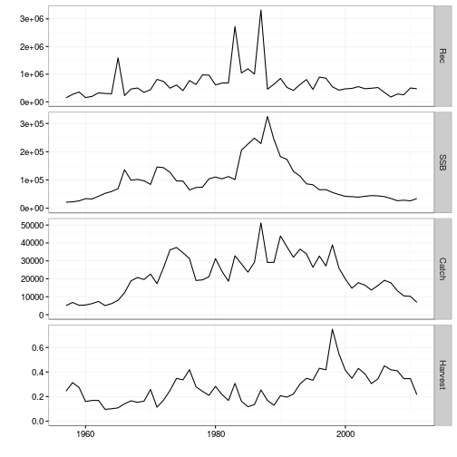

 


This tutorial details methods for reading various formats of data into R for generating the `FLStock` object class.

## Required packages

To follow this tutorial you should have installed the following packages:

- CRAN: [ggplot2](https://cran.r-project.org/web/packages/ggplot2/index.html)
- FLR: [FLCore](http://www.flr-project.org/FLCore/); [ggplotFL](http://www.flr-project.org/ggplotFL/)

You can do so as follows,


```r
install.packages(c("ggplot2"))
install.packages(c("ggplotFL"), repos="http://flr-project.org/R")
```


```r
# This chunk loads all necessary packages, trims pkg messages
library(FLCore)
library(ggplotFL)
```

# FLStock objects 

This section covers methods for reading in the data required to construct `FLStock` objects.

## Reading files (csv, dat, ...)

Fisheries data are generally stored in different format (cvs, excel, SAS...). R provides tools to read and import data from simple text files to more advanced SAS files or databases. [Datacamp](https://www.datacamp.com/community/tutorials/importing-data-r-part-two#gs.kNzBd5k) is a nice tutorial to quickly import data into R.

Your data are stored in a folder in your computer or a server. You have to tell R what is the path to the data.
You can check the working directory already active in your R session using the command getwd(). 
To set the working directory use setwd("directory name"). Case is important, use // or \ for separating folders and directories in Windows.

This tutorial will give some examples but regardless the format, the different steps are:
- Finding the right function to import data into R
- Reshaping the data as a matrix 
- creating an FLQuant object

### Importing files into R (exemple of csv file)

There is many ways of reading csv files. 
`read.table` with 'header', 'sep', 'dec' and 'row.names' options will allow you reading all .csv and .txt files

The `read.csv` or `read.csv2` function are very useful to read csv files. 


```r
catch.n <- read.csv("src/Data/catch_numbers.csv",row=1)
```

We have read in the data as a data.frame


```r
class(catch.n)
```

```
## [1] "data.frame"
```

The data are now in your R environment, before creating a **FLQuant** object, you need to make sure it is consistent with the type of object and formatting that is needed to run the `FLQuant()` function. To get information on the structure and format needed type ?FLQuant in your R Console.


## Reshaping data as a matrix 

FLQuant accept 'vector', 'array' or 'matrix'. 
We can convert the object catch.n to a matrix


```r
catch.n.matrix <- as.matrix(catch.n)
catch.n.matrix[,1:8]
```

```
##   X1957 X1958 X1959 X1960 X1961 X1962 X1963 X1964
## 1     0   100  1060   516  1768   259   132    88
## 2  7709  3349  7251 18221  7129  7170  6446  7030
## 3  9965  9410  3585  7373 14342  5535  5929  5903
## 4  1394  6130  8642  3551  6598 10427  2032  4048
## 5  6235  4065  3222  2284  2481  5235  3192  2195
## 6  2062  5584  1757   770  2392  3322  3541  3972
## 7  1720  6666  3699  1924  1659  7289  5889  9168
```

A `FLQuant` object is made of six dimensions. The name of the first dimension can be altered by the user from its default, quant. This could typically be age or length for data related to natural populations. The only name not accepted is 'cohort', as data structured along cohort should be stored using the `FLCohort` class instead. Other dimensions are always names as follows: year, for the calendar year of the data point; unit, for any kind of division of the population, e.g. by sex; season, for any temporal strata shorter than year; area, for any kind of spatial stratification; and iter, for replicates obtained through bootstrap, simulation or Bayesian analysis.

When importing catch number for example, the input object needs to be formatted as such: age or length in the first dimension and years in the second dimension. If the object is not formatted in the right way, you can use the `reshape()` function from the package [reshape2](https://cran.r-project.org/web/packages/reshape2/index.html).


## Making an FLQuant object 

We need to specify the dimnames

```r
catch.n.flq <- FLQuant(catch.n.matrix, dimnames=list(age=1:7, year = 1957:2011))
catch.n.flq[,1:7]
```

```
## An object of class "FLQuant"
## , , unit = unique, season = all, area = unique
## 
##    year
## age 1957  1958  1959  1960  1961  1962  1963 
##   1     0   100  1060   516  1768   259   132
##   2  7709  3349  7251 18221  7129  7170  6446
##   3  9965  9410  3585  7373 14342  5535  5929
##   4  1394  6130  8642  3551  6598 10427  2032
##   5  6235  4065  3222  2284  2481  5235  3192
##   6  2062  5584  1757   770  2392  3322  3541
##   7  1720  6666  3699  1924  1659  7289  5889
## 
## units:  NA
```

## Reading common fisheries data formats 

FLCore contains functions for reading in fish stock data in commonly used formats. To read a single variable (e.g. numbers-at-age, maturity-at-age) from the **Lowestoft VPA** format you use the `readVPA` function. The following example reads the catch numbers-at-age for herring:


```r
# Read from a VPA text file
catch.n <- readVPAFile(file.path('src','Data','her-irlw',"canum.txt"))
class(catch.n)
```

```
## [1] "FLQuant"
## attr(,"package")
## [1] "FLCore"
```
This can be repeated for each of the data files. In addition, functions are available for Multifan-CL format  `readMFCL` and ADMB `readADMB`.

Alternatively, if you have the full information for a stock in the **Lowestoft VPA**, **Adapt**, **CSA** or **ICA** format you can read in together using the `readFLStock` function. Here, you point the function to the index file, with all other files in the same directory:


```r
# Read a collection of VPA files, pointing to the Index file:
her <- readFLStock(file.path('src','Data','her-irlw','index.txt'))
class(her)
```

```
## [1] "FLStock"
## attr(,"package")
## [1] "FLCore"
```
Which we can see correctly formats the data as an `FLStock` object.


```r
summary(her)
```

```
## An object of class "FLStock"
## 
## Name: Herring VIa(S) VIIbc  
## Description: Imported from a VPA file. ( src/Data/her-irl [...] 
## Quant: age 
## Dims:  age 	year	unit	season	area	iter
## 	7	55	1	1	1	1	
## 
## Range:  min	max	pgroup	minyear	maxyear	minfbar	maxfbar 
## 	1	7	NA	1957	2011	1	7	
## 
## catch         : [ 1 55 1 1 1 1 ], units =  NA 
## catch.n       : [ 7 55 1 1 1 1 ], units =  NA 
## catch.wt      : [ 7 55 1 1 1 1 ], units =  NA 
## discards      : [ 1 55 1 1 1 1 ], units =  NA 
## discards.n    : [ 7 55 1 1 1 1 ], units =  NA 
## discards.wt   : [ 7 55 1 1 1 1 ], units =  NA 
## landings      : [ 1 55 1 1 1 1 ], units =  NA 
## landings.n    : [ 7 55 1 1 1 1 ], units =  NA 
## landings.wt   : [ 7 55 1 1 1 1 ], units =  NA 
## stock         : [ 1 55 1 1 1 1 ], units =  NA 
## stock.n       : [ 7 55 1 1 1 1 ], units =  NA 
## stock.wt      : [ 7 55 1 1 1 1 ], units =  NA 
## m             : [ 7 55 1 1 1 1 ], units =  NA 
## mat           : [ 7 55 1 1 1 1 ], units =  NA 
## harvest       : [ 7 55 1 1 1 1 ], units =  f 
## harvest.spwn  : [ 7 55 1 1 1 1 ], units =  NA 
## m.spwn        : [ 7 55 1 1 1 1 ], units =  NA
```
Note: the units for the slots have not been set. We will deal with this in the next section.

In addition, this object only contains the input data for the stock assessment, not any estimated values (e.g. harvest rates, stock abundances). You can add these to the object as follows:


```r
her@stock.n <- readVPAFile(file.path('src','Data','her-irlw',"n.txt"))
print(her@stock.n[,ac(2007:2011)]) # only print 2007:2011
```

```
## An object of class "FLQuant"
## , , unit = unique, season = all, area = unique
## 
##    year
## age 2007     2008     2009     2010     2011    
##   1 174571.1 282187.1 256537.9 500771.9 473853.8
##   2 124606.8  64089.7 103602.4  94215.4 183911.3
##   3 113657.7  75691.6  39075.8  65137.7  59210.2
##   4  55794.7  60037.5  40312.1  22271.7  37090.3
##   5  33210.4  28921.5  31447.1  23016.5  12700.7
##   6  17193.0  16241.9  14308.2  17112.1  12507.7
##   7   5355.8   9315.2   8255.6   9662.4  16579.1
## 
## units:  NA
```

```r
her@harvest <- readVPAFile(file.path('src','Data','her-irlw',"f.txt"))
```
Now we have a fully filled `FLStock` object. But let's check the data are consistent.


```r
# The sum of products (SOP)
apply(her@landings.n * her@landings.wt, 2, sum)[,ac(2007:2011)]
```

```
## An object of class "FLQuant"
## , , unit = unique, season = all, area = unique
## 
##      year
## age   2007    2008    2009    2010    2011   
##   all 17790.6 13340.9 10482.3 10232.6  6921.2
## 
## units:  NA
```

```r
# and the value read in from the VPA file
her@landings[,ac(2007:2011)]
```

```
## An object of class "FLQuant"
## , , unit = unique, season = all, area = unique
## 
##      year
## age   2007  2008  2009  2010  2011 
##   all 17791 13340 10468 10241  6919
## 
## units:  NA
```

```r
## They are not the same!!  We correct the landings to be the same as the SOP - there is a handy function for this purpose
her@landings <- computeLandings(her)

# In addition, there is no discard information
her@discards.wt[,ac(2005:2011)]
```

```
## An object of class "FLQuant"
## , , unit = unique, season = all, area = unique
## 
##    year
## age 2005 2006 2007 2008 2009 2010 2011
##   1 NA   NA   NA   NA   NA   NA   NA  
##   2 NA   NA   NA   NA   NA   NA   NA  
##   3 NA   NA   NA   NA   NA   NA   NA  
##   4 NA   NA   NA   NA   NA   NA   NA  
##   5 NA   NA   NA   NA   NA   NA   NA  
##   6 NA   NA   NA   NA   NA   NA   NA  
##   7 NA   NA   NA   NA   NA   NA   NA  
## 
## units:  NA
```

```r
her@discards.n[,ac(2005:2011)]
```

```
## An object of class "FLQuant"
## , , unit = unique, season = all, area = unique
## 
##    year
## age 2005 2006 2007 2008 2009 2010 2011
##   1 NA   NA   NA   NA   NA   NA   NA  
##   2 NA   NA   NA   NA   NA   NA   NA  
##   3 NA   NA   NA   NA   NA   NA   NA  
##   4 NA   NA   NA   NA   NA   NA   NA  
##   5 NA   NA   NA   NA   NA   NA   NA  
##   6 NA   NA   NA   NA   NA   NA   NA  
##   7 NA   NA   NA   NA   NA   NA   NA  
## 
## units:  NA
```

```r
# Set up the discards and catches
her@discards.wt   <- her@landings.wt
her@discards.n[]  <- 0
her@discards      <- computeDiscards(her)
her@catch         <- her@landings
her@catch.wt      <- her@landings.wt
her@catch.n       <- her@landings.n
```
Functions are available to `computeLandings`, `computeDiscards`, `computeCatch` and `computeStock`. These functions take the argument `slot = 'catch'`, `slot = 'wt'` and `slot = 'n'` to compute the total weight, individual weight and numbers respectively, in addition to `slot = 'all'`. 

## Description, units, ranges etc..

Before we are finished, we want to ensure the units and range references are correct. This is important as the derived calculations require the correct scaling.

First, let's ensure an appropriate name and description are assigned:


```r
summary(her)
```

```
## An object of class "FLStock"
## 
## Name: Herring VIa(S) VIIbc  
## Description: Imported from a VPA file. ( src/Data/her-irl [...] 
## Quant: age 
## Dims:  age 	year	unit	season	area	iter
## 	7	55	1	1	1	1	
## 
## Range:  min	max	pgroup	minyear	maxyear	minfbar	maxfbar 
## 	1	7	NA	1957	2011	1	7	
## 
## catch         : [ 1 55 1 1 1 1 ], units =  NA 
## catch.n       : [ 7 55 1 1 1 1 ], units =  NA 
## catch.wt      : [ 7 55 1 1 1 1 ], units =  NA 
## discards      : [ 1 55 1 1 1 1 ], units =  NA 
## discards.n    : [ 7 55 1 1 1 1 ], units =  NA 
## discards.wt   : [ 7 55 1 1 1 1 ], units =  NA 
## landings      : [ 1 55 1 1 1 1 ], units =  NA 
## landings.n    : [ 7 55 1 1 1 1 ], units =  NA 
## landings.wt   : [ 7 55 1 1 1 1 ], units =  NA 
## stock         : [ 1 55 1 1 1 1 ], units =  NA 
## stock.n       : [ 7 55 1 1 1 1 ], units =  NA 
## stock.wt      : [ 7 55 1 1 1 1 ], units =  NA 
## m             : [ 7 55 1 1 1 1 ], units =  NA 
## mat           : [ 7 55 1 1 1 1 ], units =  NA 
## harvest       : [ 7 55 1 1 1 1 ], units =  NA 
## harvest.spwn  : [ 7 55 1 1 1 1 ], units =  NA 
## m.spwn        : [ 7 55 1 1 1 1 ], units =  NA
```

```r
#name and descriptions
her@name # ok
```

```
## [1] "Herring VIa(S) VIIbc "
```

```r
her@desc # ok
```

```
## [1] "Imported from a VPA file. ( src/Data/her-irlw/index.txt ).  Tue Feb 14 09:40:12 2017"
```

```r
# Set the Fbar range for the stock 
her@range[c('minfbar','maxfbar')] # ok, but can be filled with c(min,max)
```

```
## minfbar maxfbar 
##       1       7
```

```r
# set the plus group
her@range['plusgroup']  <- 7 # final year is a plusgroup

## Units
units(her@catch)    <- units(her@discards)    <- units(her@landings)    <- units(her@stock)    <- 'tonnes'
units(her@catch.n)  <- units(her@discards.n)  <- units(her@landings.n)  <- units(her@stock.n)  <- 'tonnes'
units(her@catch.wt) <- units(her@discards.wt) <- units(her@landings.wt) <- units(her@stock.wt) <- 'tonnes'
units(her@harvest) <- 'f'
```
This should now have the correct units defined:


```r
summary(her)
```

```
## An object of class "FLStock"
## 
## Name: Herring VIa(S) VIIbc  
## Description: Imported from a VPA file. ( src/Data/her-irl [...] 
## Quant: age 
## Dims:  age 	year	unit	season	area	iter
## 	7	55	1	1	1	1	
## 
## Range:  min	max	pgroup	minyear	maxyear	minfbar	maxfbar 
## 	1	7	7	1957	2011	1	7	
## 
## catch         : [ 1 55 1 1 1 1 ], units =  tonnes 
## catch.n       : [ 7 55 1 1 1 1 ], units =  tonnes 
## catch.wt      : [ 7 55 1 1 1 1 ], units =  tonnes 
## discards      : [ 1 55 1 1 1 1 ], units =  tonnes 
## discards.n    : [ 7 55 1 1 1 1 ], units =  tonnes 
## discards.wt   : [ 7 55 1 1 1 1 ], units =  tonnes 
## landings      : [ 1 55 1 1 1 1 ], units =  tonnes 
## landings.n    : [ 7 55 1 1 1 1 ], units =  tonnes 
## landings.wt   : [ 7 55 1 1 1 1 ], units =  tonnes 
## stock         : [ 1 55 1 1 1 1 ], units =  tonnes 
## stock.n       : [ 7 55 1 1 1 1 ], units =  tonnes 
## stock.wt      : [ 7 55 1 1 1 1 ], units =  tonnes 
## m             : [ 7 55 1 1 1 1 ], units =  NA 
## mat           : [ 7 55 1 1 1 1 ], units =  NA 
## harvest       : [ 7 55 1 1 1 1 ], units =  f 
## harvest.spwn  : [ 7 55 1 1 1 1 ], units =  NA 
## m.spwn        : [ 7 55 1 1 1 1 ], units =  NA
```

```r
plot(her) + theme_bw() # using the simple bw theme
```



# FLIndices

Youen text here


# FLFleets

Paul text here


# References

None

# More information

* You can submit bug reports, questions or suggestions on this tutorial at <https://github.com/flr/doc/issues>.
* Or send a pull request to <https://github.com/flr/doc/>
* For more information on the FLR Project for Quantitative Fisheries Science in R, visit the FLR webpage, <http://flr-project.org>.

## Software Versions

* R version 3.3.1 (2016-06-21)
* FLCore: 2.6.0.20170130
* ggplotFL: 2.5.9.9000
* ggplot2: 2.1.0
* **Compiled**: Tue Feb 14 09:40:13 2017

## License

This document is licensed under the [Creative Commons Attribution-ShareAlike 4.0 International](https://creativecommons.org/licenses/by-sa/4.0) license.

## Author information

**Iago MOSQUEIRA**. European Commission Joint Research Centre (JRC), Institute for the Protection and Security of the Citizen (IPSC), Maritime Affairs Unit, Via E. Fermi 2749, 21027 Ispra VA, Italy. <https://ec.europa.eu/jrc/>
