PLOTTING FLR OBJECTS USING LATTICE
================
14 February, 2017

The lattice package (Sarkar, 2008) improves on base R graphics by providing better defaults and the ability to easily display multivariate relationships. In particular, the package supports the creation of trellis graphs - graphs that display a variable or the relationship between variables, conditioned on one or more other variables. Lattice methods (e.g. xyplot(), bwplot(), dotplot()) are available for FLR classes in FLCore, and the standard plots (plot()) in FLR are lattice-based.

Required packages
-----------------

To follow this tutorial you should have installed the following packages:

-   CRAN: [lattice](https://cran.r-project.org/web/packages/lattice/index.html)
-   FLR: [FLCore](http://www.flr-project.org/FLCore/)

You can do so as follows,

``` r
install.packages(c("lattice"))
install.packages(c("FLCore"), repos="http://flr-project.org/R")
```

``` r
# This chunk loads all necessary packages, trims pkg messages
library(FLCore)
library(lattice)
```

GRAPH TYPES AVAILABLE
=====================

In case of *plot* the name of the object could be used, e.g. *plot(ple4)*

The typical formula for lattice plots is:

*graph\_type(formula, data=FLQuant)*

where options could be selected from

| Graph Type | Description        | Formula    |
|------------|--------------------|------------|
| barchart   | bar chart          | x~A or A~x |
| bwplot     | boxplot            | x~A or A~x |
| dotplot    | dotplot            | ~x         |
| histogram  | histogram          | ~x         |
| xyplot     | scatterplot        | y~x        |
| wireframe  | 3D wireframe graph | z~y\*x     |

STANDARD LATTICE BASED FLR PLOTS
================================

The standard plot() function in FLR returns lattice-based plots.

``` r
## Import your data from FLR
#place in the North Sea
data(ple4)
data(nsher)

# And the standard plots in FLR are lattice-based
# plot for FLQuant
plot(catch.n(ple4))
```

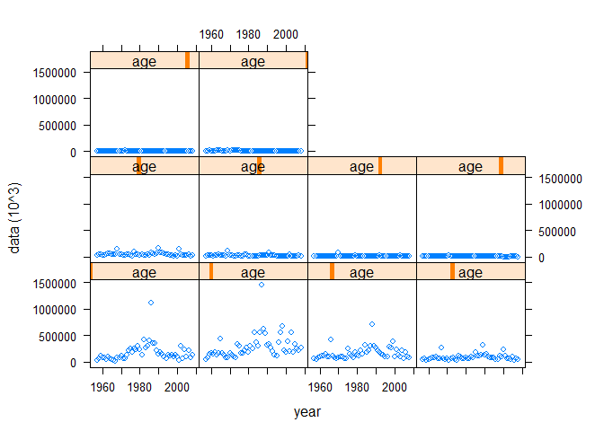

``` r
# Plot FLStock
plot(ple4)
```

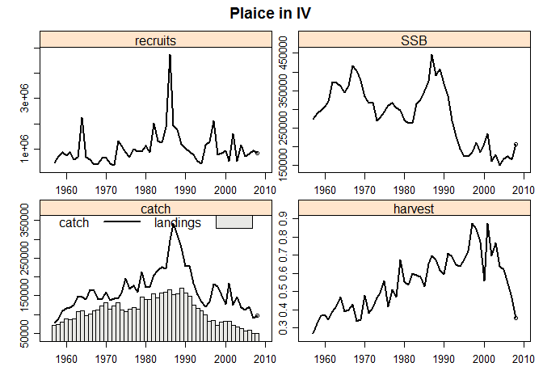

``` r
# Plot FLSR
plot(nsher)
```

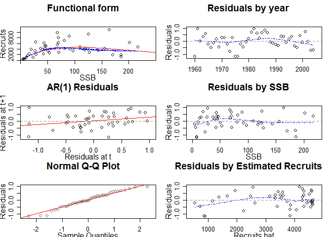

PLOTTING FLR OBJECTS USING LATTICE
==================================

``` r
# The conversion to data.frame requires columns names for dims and 'data'. 
#The following names of FL object are used
head(as.data.frame(catch(ple4)))
```

    ##   age year   unit season   area iter      data
    ## 1 all 1957 unique    all unique    1  78422.95
    ## 2 all 1958 unique    all unique    1  88240.06
    ## 3 all 1959 unique    all unique    1 109237.62
    ## 4 all 1960 unique    all unique    1 117137.86
    ## 5 all 1961 unique    all unique    1 118330.99
    ## 6 all 1962 unique    all unique    1 125272.44

XYPLOTS for FLR
---------------

``` r
xyplot(data~year, data=catch(ple4), type='b', pch=19)
```

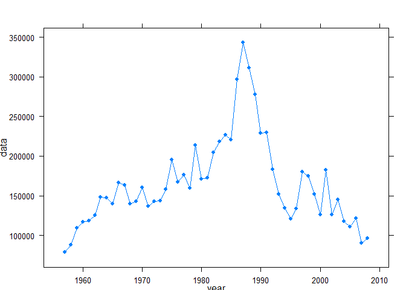

``` r
# values in FLQuant turn into a 'data' column to use in formulas
xyplot(data~year, groups=age, data=catch.n(ple4), type='l', ylab='Catch (t)')
```

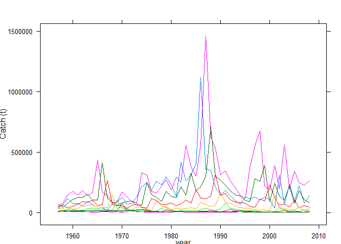

``` r
# values in FLQuant turn into a 'data' column to use in formulas
xyplot(data~year|age, data=catch.n(ple4), type='l', ylab='Catch (t)')
```

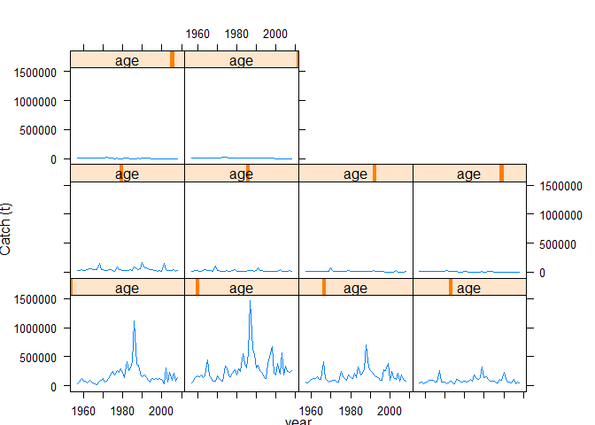

``` r
# Methods are also available for FLQuants, with elements names' variable 'qname'
xyplot(data~year|qname, data=FLQuants(SSB=ssb(ple4), Yield=catch(ple4)))
```


``` r
# Methods are also available for FLQuants, with elements names' variable 'qname'
xyplot(data~year|qname, data=FLQuants(SSB=ssb(ple4), Yield=catch(ple4)))
```

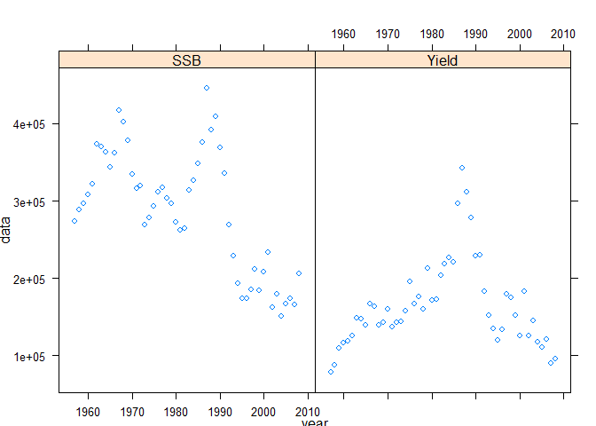

BWPLOTS
-------

``` r
# bwplot
bwplot(data~year, rlnorm(200, fbar(ple4), 0.15))
```

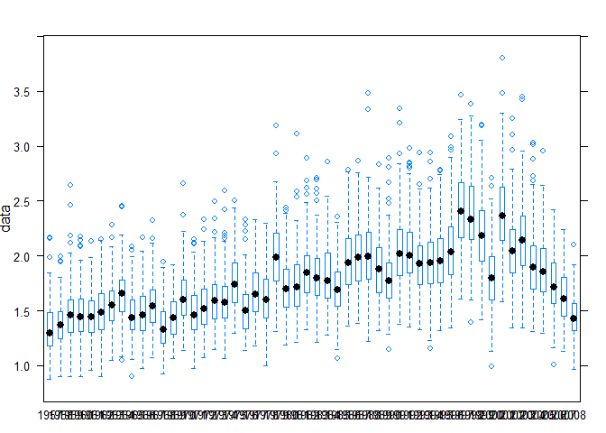

DOTPLOTS
--------

``` r
dotplot(data~year, groups=age, harvest(ple4))
```

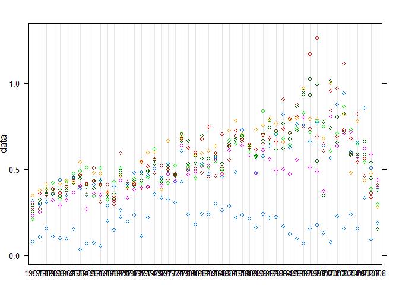

HISTOGRAM
---------

``` r
histogram(~data|year, catch.n(ple4))
```


HISTOGRAM
---------

``` r
histogram(~data|year, catch.n(ple4))
```

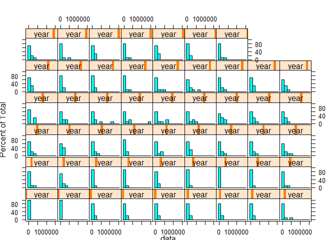

WIREFRAME
---------

``` r
wireframe(data~age*year, data=harvest(ple4),zlab="F")
```

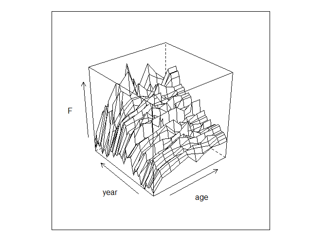

FLR specific plots BUBBLES
==========================

``` r
# Our own bubbles method
bubbles(age~year, data=catch.n(ple4), bub.scale=5)
```

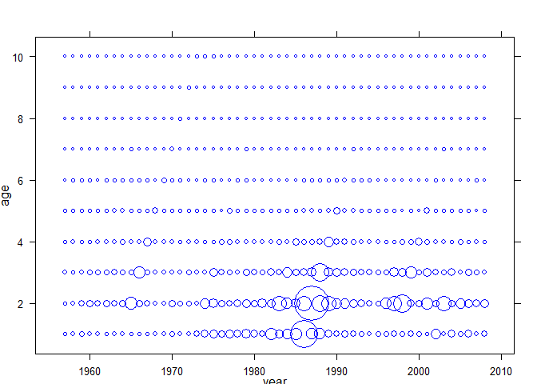

``` r
# Select age classes for the analysis
bubbles(age~year, data=catch.n(ple4)[5:10,], bub.scale=10)
```

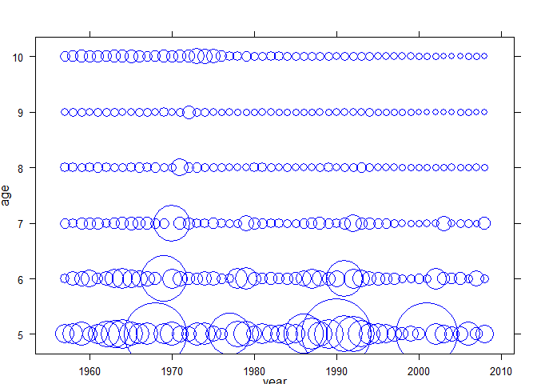

References
==========

More information
================

-   You can submit bug reports, questions or suggestions on this tutorial at <https://github.com/flr/doc/issues>.
-   Or send a pull request to <https://github.com/flr/doc/>
-   For more information on the FLR Project for Quantitative Fisheries Science in R, visit the FLR webpage, <http://flr-project.org>.

Software Versions
-----------------

-   R version 3.3.2 (2016-10-31)
-   FLCore: 2.6.0.20170123
-   ggplotFL: 2.5.20161007
-   ggplot2: 2.2.0
-   **Compiled**: Tue Feb 14 10:29:21 2017

License
-------

This document is licensed under the [Creative Commons Attribution-ShareAlike 4.0 International](https://creativecommons.org/licenses/by-sa/4.0) license.

Author information
------------------

**Iago MOSQUEIRA**. European Commission Joint Research Centre (JRC), Institute for the Protection and Security of the Citizen (IPSC), Maritime Affairs Unit, Via E. Fermi 2749, 21027 Ispra VA, Italy. <https://ec.europa.eu/jrc/>
