```
## Error in library(captioner): there is no package called 'captioner'
```
 
This document presents the statistical catch-at-age stock assessment model developed as part of the Assessment For All (a4a) initiative of the European Commission Joint Research Centre. The stock assessment model framework is a non-linear catch-at-age model implemented in [R](http://www.r-project.org/) and [FLR](http://www.flr-project.org/), and using [ADMB](http://www.admb-project.org/) that can be applied rapidly to a wide range of situations with low parametrization requirements. The model structure is defined by submodels, which are the different parts that require structural assumptions. There are 5 submodels in operation: a model for F-at-age, a model for the initial age structure, a model for recruitment, a (list) of model(s) for abundance indices catchability-at-age, and a list of models for the observation variance of catch-at-age and abundance indices. The submodels form use linear models. This opens the possibility of using the linear modelling tools available in R: see for example the mgcv (http://cran.r-project.org/web/packages/mgcv/index.html) gam formulas, or factorial design formulas using. Detailed model formulas, several diagnostic tools and a large set of models are presented in the document. Additionaly, advanced features like external weighting of the likelihood components and MCMC fits are also described. The target audience for this document are readers with some experience in R and some background on stock assessment. The document explains the approach being developed by a4a for fish stock assessment and scientific advice. It presents a mixture of text and code, where the first explains the concepts behind the methods, while the last shows how these can be run with the software provided.

## Required packages

## Required packages

To follow this tutorial you should have installed the following packages:

- CRAN: [copula](https://cran.r-project.org/web/packages/copula/index.html), [triangle](https://cran.r-project.org/web/packages/triangle/index.html), [coda](https://cran.r-project.org/web/packages/coda/index.html), [XML](https://cran.r-project.org/web/packages/XML/index.html),[reshape2](https://cran.r-project.org/web/packages/reshape2/index.html), [latticeExtra](https://cran.r-project.org/web/packages/latticeExtra/index.html)

- FLR: [FLCore](http://www.flrproject.org/FLCore/), [FLa4a](http://www.flrproject.org/FLa4a/)

You can do so as follows,


``` r
install.packages(c("copula","triangle", "coda", "XML", "reshape2", "latticeExtra"))
# from FLR
install.packages(c("FLCore", "FLa4a"), repos=c(FLR="https://flr.r-universe.dev", CRAN="https://cloud.r-project.org"))
```


``` r
# This chunk loads all necessary packages
library(FLa4a)
library(latticeExtra)
# datasets
data(ple4)
data(ple4.indices)
data(ple4.index)
```

# Background

The stock assessment model framework is a non-linear catch-at-age model implemented in R/FLR/ADMB that can be applied rapidly to a wide range of situations with low parametrization requirements.

In the a4a assessment model, the model structure is defined by submodels, which are the different parts of a statistical catch at age model that require structural assumptions.

There are 5 submodels in operation: 
- a model for F-at-age,
- a (list) of model(s) for abundance indices catchability-at-age,
- a model for recruitment, 
- a list of models for the observation variance of catch-at-age and abundance indices,
- a model for the initial age structure,

In practice, we fix the variance models and the initial age structure models, but in theory these can be changed.

The submodels form use linear models. This opens the possibility of using the linear modelling tools available in R: see for example the [mgcv](http://cran.r-project.org/web/packages/mgcv/index.html) gam formulas, or factorial design formulas using `lm()`. In R's linear modelling language, a constant model is coded as $\sim 1$, while a slope over age would simply be $\sim age$. For example, we can write a traditional year/age separable F model like $\sim factor(age) + factor(year)$.

The 'language' of linear models has been developing within the statistical community for many years, and constitutes an elegant way of defining models without going through the complexity of mathematical representations. This approach makes it also easier to communicate among scientists:

- [1965 J. A. Nelder](http://rspa.royalsocietypublishing.org/content/283/1393/147.short), notation for randomized block design
- [1973 Wilkinson and Rodgers](http://www.jstor.org/stable/info/2346786), symbolic description for factorial designs
- [1990 Hastie and Tibshirani](http://books.google.com/books?isbn=0412343908), introduced notation for smoothers
- [1991 Chambers and Hastie](http://books.google.com/books?isbn=041283040X), further developed for use in S

There are two basic types of assessments available in a4a: the management procedure fit and the full assessment fit. The management procedure fit does not compute estimates of covariances and is therefore quicker to execute, while the full assessment fit returns parameter estimates and their covariances at the expense of longer fitting time.

# Stock assessment model details

Modelled catches $C$ are defined in terms of the three quantities, natural mortality $M$, fishing mortality $F$ and recruitment $R$, using a modified form of the well known Baranov catch equation:

$$  C_{ay} = \frac{\bf{F}_{ay}}{\bf{F}_{ay}+M_{ay}}\left(1 - e^{-(\bf{F}_{ay}+M_{ay})}\right) \bf{R}_{y}e^{-\sum (\bf{F}_{ay} + M_{ay})} $$

where $a$ and $y$ denote age and year. Modelled survey indices $I$ are defined in terms of the same three quantities with the addition of survey catchability $Q$:

$$I_{ays} = \bf{Q}_{ays} \bf{R}_{y}e^{-\sum (\bf{F}_{ay} + M_{ay})}$$

where $s$ denotes survey or abundance index and allows for multiple surveys to be considered. Observed catches $C^{(obs)}$ and the observed survey indices $I^{(obs)}$ are assumed to be log-normally distributed, or equivalently, normally distributed on the log-scale, with age, year and survey specific observation variance:

$$  \log C^{(obs)}_{ay} \sim \text{Normal} \Big( \log C_{ay}, \bf{\sigma}^2_{ay}\Big) \qquad
  \log I^{(obs)}_{ays} \sim \text{Normal} \Big( \log I_{ays}, \bf{\tau}^2_{ays} \Big) $$

The full log-likelihood for the a4a statistical catch at age model can now be defined as the sum of the log-likelihood of the observed catches ($\ell_N$ is the log-likelihood of a normal distribution)

$$  \ell_C = \sum_{ay} w^{(c)}_{ay}\ \ell_N \Big( \log C_{ay}, \bf{\sigma}^2_{ay} ;\ \log C^{(obs)}_{ay} \Big) $$

and the log-likelihood of the observed survey indices

$$  \ell_I = \sum_s \sum_{ay} w^{(s)}_{ays}\ \ell_N \Big( \log I_{ays}, \bf{\tau}_{ays}^2 ;\ \log I^{(obs)}_{ays} \Big)$$

giving the total log-likelihood

$$\ell = \ell_C + \ell_I$$

which is defined in terms of the strictly positive quantites, $M_{ay}$, $F_{ay}$, $Q_{ays}$ and $R_{y}$, and the observation variances $\sigma_{ay}$ and $\tau_{ays}$.  As such, the log-likelihood is over-parameterised as there are many more parameters than observations.  In order to reduce the number of parameters, $M_{ay}$ is assumed known (as is common), and the remaining parameters are written in terms of a linear combination of covariates $x_{ayk}$, e.g.

$$\log F_{ay} = \sum_k \beta_k x_{ayk}$$

where $k$ is the number of parameters to be estimated and is sufficiently small. Using this tecnique the quantities $\log F$, $\log Q$, $\log \sigma$ and $\log \tau$
%$\log \text{initial\,age\,structure}$ % this is not present in the above
(in bold in the equations above) can be described by a reduced number of parameters.  The following section has more discussion on the use of linear models in a4a.

## Stock recruitment relationships

The a4a statistical catch at age model can addiionally allow for a functional relationship to be imposed that links predicted recruitment $\tilde{R}$ based on spawning stock biomass and modelled recruitment $R$, included as a fixed variance random effect.  Options for the relationship are the hard coded models Ricker, Beverton Holt, smooth hockeystick or geometric mean. This is implemented by including a third component in the log-likelihood

$$\ell_{SR} = \sum_y \ell_N \Big( \log \tilde{R}_y(a, b), \phi_y^2 ;\ \log R_y \Big)$$

giving the total log-likelihood

$$\ell = \ell_C + \ell_I + \ell_{SR}$$

Using the (time varying) Ricker model as an example, predicted recruitment is

$$\tilde{R}_y(a_y,b_y) = a_y S_{y-1} e^{-b_y S_{y-1}}$$

where $S$ is spawning stock biomass derived from the model parameters $F$ and $R$, and the fixed quantites $M$ and mean weights by year and age. It is assumed that $R$ is log-normally distributed, or equivalently, normally distributed on the log-scale about the (log) recruitment predicted by the SR model $\tilde{R}$, with known variance $\phi^2$, i.e.

$$\log R_y \sim \text{Normal} \Big( \log \tilde{R}_y, \phi_y^2 \Big)$$

which leads to the definition of $\ell_{SR}$ given above. In all cases $a$ and $b$ are strictly positive, and with the quantities $F$, $R$, etc. linear models are used to parameterise $\log a$ and/or $\log b$, where relevant.

By default, recruitment $R$ as apposed to the reruitment predicted from a stock recruitment model $\tilde{R}$, is specified as a linear model with a parameter for each year, i.e.

$$\log R_y = \gamma_y$$

This is to allow modelled recruitment $R_y$ to be shrunk towards the stock recruitment model.  However, if it is considered appropriate that recruitment can be determined exactly by a relationship with covariates, it is possible, to instead define $\log R$ in terms of a linear model in the same way as $\log F$, $\log Q$, $\log \sigma$ and $\log \tau$.  %But this is pretty much the same as taking a geometric mean, with a model on log a, and making the variance very small.


# Quick and dirty

Here we show a simple example of using the assessment model using plaice in the North Sea. The default settings of the stock assessment model work reasonably well. It's an area of research that will improve with time. Note that because the survey index for plaice has missing values we get a warning saying that we assume these values are missing at random.


``` r
data(ple4)
data(ple4.indices)
fit <- sca(ple4, ple4.indices)
```

To inspect the stock assessment summary constituted of trends of fishing mortality (harvest), spawning stock biomass (SSB), catch and recruits, the user may add the `a4aFit` object to the original `FLStock` object using the `+` method and plot the result (\@ref(fig:summ)).


``` r
stk <- ple4 + fit
plot(stk)
```

<div class="figure" style="text-align: center">
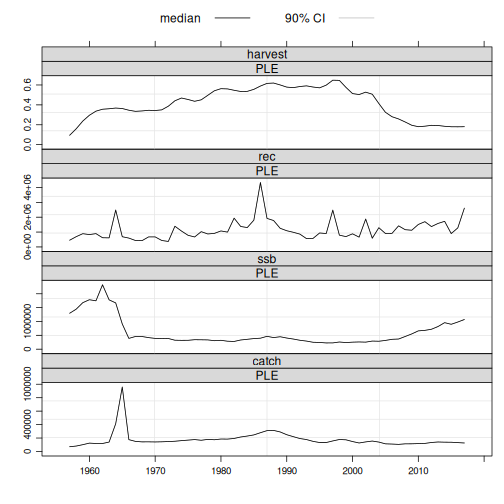
<p class="caption">Stock summary for Plaice in ICES area IV, recruits, SSB (Stock Spawning Biomass), catch (catch and landings) and harvest (fishing mortality or F).</p>
</div>

In more detail, one can plot a 3D representation of fishing mortality (\@ref(fig:F)),


``` r
wireframe(harvest(fit), zlab="F")
```

<div class="figure" style="text-align: center">
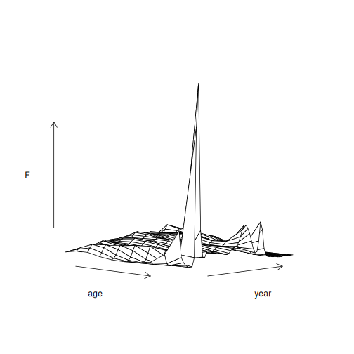
<p class="caption">3D contour plot of estimated fishing mortality at age and year</p>
</div>

population abundance (\@ref(fig:N)) is displaid as a 3D wireframe,

<div class="figure" style="text-align: center">
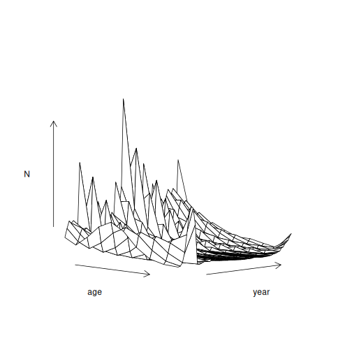
<p class="caption">Population abundance by age and year</p>
</div>

as well as catch-at-age (\@ref(fig:C)).

<div class="figure" style="text-align: center">
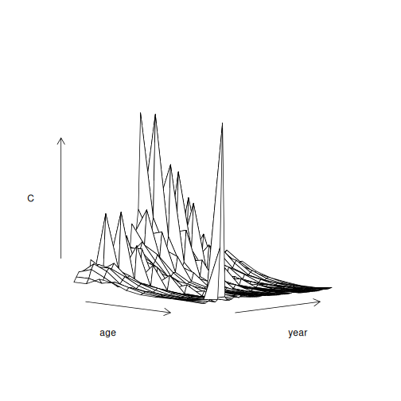
<p class="caption">Catches in number of individuals by age and year</p>
</div>

# Diagnostics

A set of plots to inspect the fit quality and assumptions are implemented. The most common is to look at standardized log-residuals to check for biased results or large variances. Note that the standardization should produce residuals with variance ~1, which means that most residual values should be between $\sim -2$ and $\sim 2$. These residuals also allow the user to check for deviances from the log-normal assumption.

The `residuals()` method will compute standardized residuals which can be plotted using a set of packed methods.


``` r
res <- residuals(fit, ple4, ple4.indices)
```

\@ref(fig:res) shows a scatterplot of residuals by age and survey, with a smoother to guide (or mis-guide ...) your visual analysis.


``` r
plot(res)
```

<div class="figure" style="text-align: center">
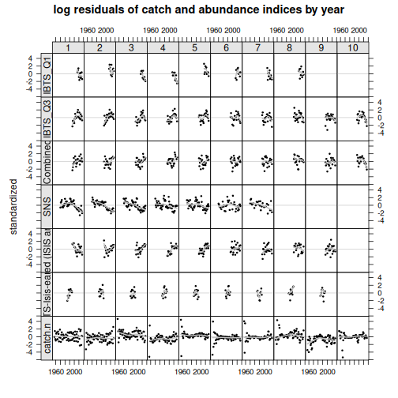
<p class="caption">Standardized residuals for abundance indices (SNS, BTS Tridens and BTS Isis) and for catch numbers (catch.n). Each panel is coded by age class, dots represent standardized residuals and lines a simple smoother.</p>
</div>

The common bubble plot by year and age for each survey are shown in \@ref(fig:bub). It shows the same information as \@ref(fig:res) but in a multivariate perspective.


``` r
bubbles(res)
```

<div class="figure" style="text-align: center">
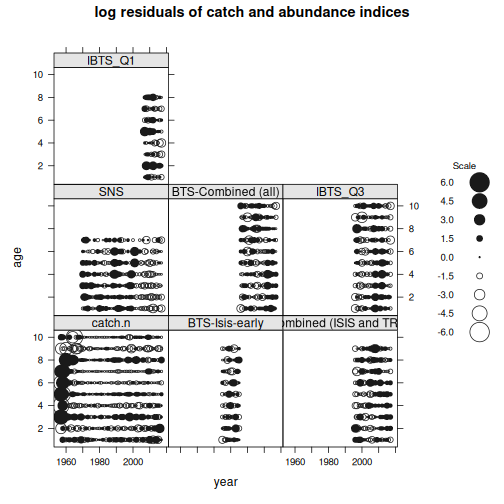
<p class="caption">Bubbles plot of standardized residuals for abundance indices (SNS, BTS Tridens and BTS Isis) and for catch numbers (catch.n).</p>
</div>

\@ref(fig:qq) shows a quantile-quantile plot to assess how well do the residuals match the normal distribution.


``` r
qqmath(res)
```

<div class="figure" style="text-align: center">
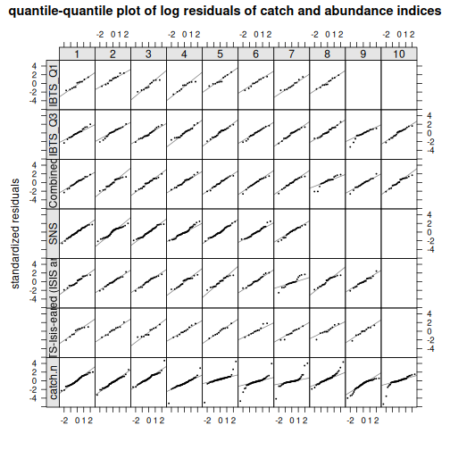
<p class="caption">Quantile-quantile plot of standardized residuals for abundance indices (SNS, BTS Tridens and BTS Isis) and for catch numbers (catch.n). Each panel is coded by age class, dots represent standardized residuals and lines the normal distribution quantiles.</p>
</div>

To have a look at how well is the model predicting catches and abundance, one can use the `plot()` method with the `a4aFit` object and the `FLStock` (\@ref(fig:selplt)) object or the `FLIndex` object.


``` r
plot(fit, ple4)
```

<div class="figure" style="text-align: center">
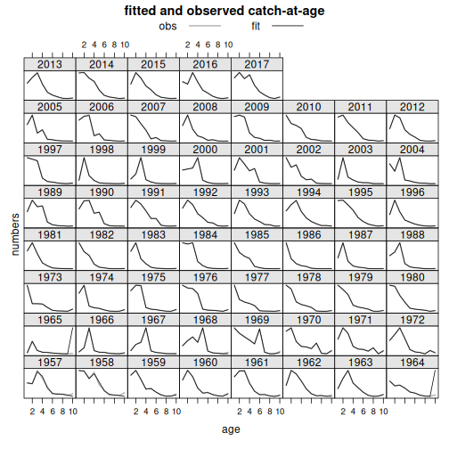
<p class="caption">Predict and observed catch-at-age</p>
</div>


``` r
plot(fit, ple4.indices)
```

<div class="figure" style="text-align: center">
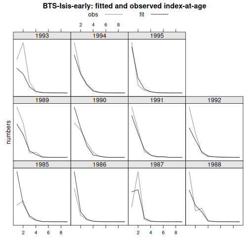
<p class="caption">Predict and observed abundance-at-age</p>
</div><div class="figure" style="text-align: center">
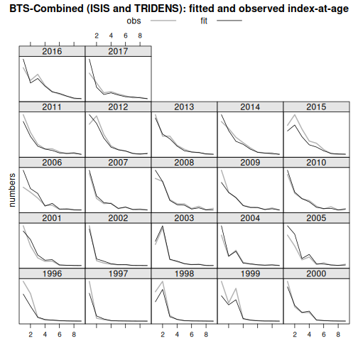
<p class="caption">Predict and observed abundance-at-age</p>
</div><div class="figure" style="text-align: center">
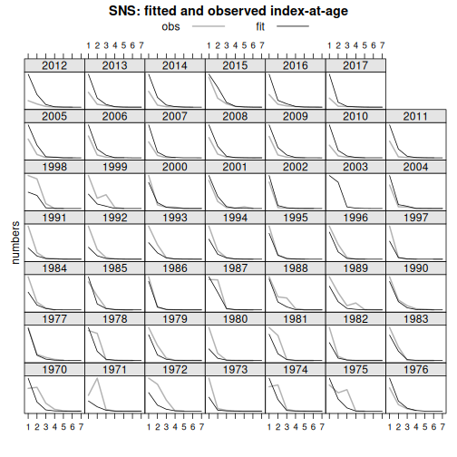
<p class="caption">Predict and observed abundance-at-age</p>
</div><div class="figure" style="text-align: center">
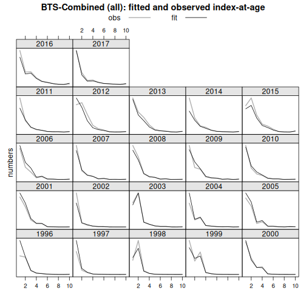
<p class="caption">Predict and observed abundance-at-age</p>
</div><div class="figure" style="text-align: center">
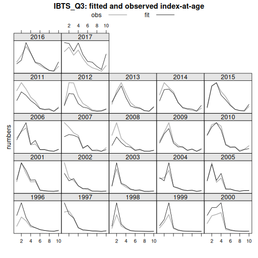
<p class="caption">Predict and observed abundance-at-age</p>
</div><div class="figure" style="text-align: center">
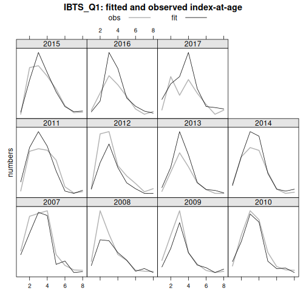
<p class="caption">Predict and observed abundance-at-age</p>
</div>

%Finally a retrospective analysis can be carried out using the method `ra()}. \@ref(fig:retro) shows the results for this assessment.

%```{r, retro, fig.cap="Retrospective analysis"}
%retro <- ra(ple4, ple4.indices, 5)
%plot(retro)
%```

To get information about the likelihood fit the method `fitSumm()` will extract information about likelihood, number of parameters, etc, and the methods `AIC()` and `BIC()` will compute the information criteria.


``` r
fitSumm(fit)
```

```
             iters
                          1
  nopar        2.870000e+02
  nlogl       -3.823602e+02
  maxgrad      2.060663e-04
  nobs         1.728000e+03
  gcv          1.185680e-01
  convergence  0.000000e+00
  accrate                NA
  nlogl_comp1 -1.058450e+03
  nlogl_comp2  6.695020e+01
  nlogl_comp3  5.643150e+01
  nlogl_comp4  4.025550e+02
  nlogl_comp5  5.836470e+01
  nlogl_comp6  6.057810e+01
  nlogl_comp7  3.121530e+01
```

``` r
AIC(fit)
```

```
[1] -190.7205
```

``` r
BIC(fit)
```

```
[1] 1374.784
```

# The statistical catch-at-age stock assessment framework - the `sca` method

The statistical catch at age (`sca()`) method used in the previous section with the default settings, can be parametrized to control other features of the stock assessment framework. The most interesting ones are the submodels for fishing mortality ($F$), catchability ($Q$) and recruitment ($R$).

An important argument for `sca()` is the type of fit, which controls if a full assessment will be performed or a management procedure type of assessment. The argument is called `fit` and can have the values 'assessment' for a full assessemt or 'MP' for a simpler assessment. By default `sca()` uses `fit='MP'`.

We'll start by looking at the submodel for $F$, then $Q$ and finally $R$.

Please note that each of these model *forms* have not been tuned to the data. The degrees of freedom of each model can be better tuned to the data by using model selection procedures such as Akaike Information Criterion (AIC) or Bayesian Information Criterion (BIC), etc.

## Fishing mortality submodel

We will now take a look at some examples for F models and the forms that we can get. We'll fix the $Q$ and $R$ submodels.

Lets start with a separable model in which age and year effects are modelled as dummy variables, using the `factor` coding provided by R (\@ref(fig:sep1)). We'll use only one index to save running time, with the code `ple4.indices[1]`. This code creates an `FLIndices` object which has the first element of our list of indices. Note the difference with `ple4.indices[[1]]` that would extract the first element of the list, an `FLIndex` object.


``` r
qmod <- list(~ factor(age))
fmod <- ~ factor(age) + factor(year)
srmod <- ~ factor(year)
fit <- sca(stock = ple4, indices = ple4.indices[1], fmodel=fmod, qmodel=qmod, srmodel=srmod)
```

<div class="figure" style="text-align: center">
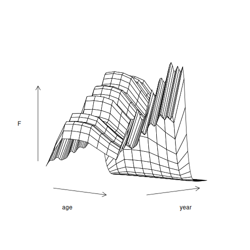
<p class="caption">Fishing mortality separable model</p>
</div>

Next we may make things a bit more interesting by using an (unpenalised) thin plate spline, where we'll borrow the smoothing splines method (`s()`) provided by package [mgcv](http://cran.r-project.org/web/packages/mgcv/). We're using the North Sea Plaice data again, and since it has 10 ages we will use a simple rule of thumb that the spline should have fewer than $\frac{10}{2} = 5$ degrees of freedom, and so we opt for 4 degrees of freedom. We will also do the same for year and model the change in F through time as a smoother with 20 degrees of freedom. Note that this is still a separable model, it's a smoothed version of the previous model (\@ref(fig:sep2)).


``` r
fmod <- ~ s(age, k=4) + s(year, k = 20)
# notice that you can specify the submodels without the argument, as an example you
# don't need fmodel=fmod, but the order should be respected...
fit <- sca(ple4, ple4.indices[1], fmod, qmod, srmod)
```

<div class="figure" style="text-align: center">
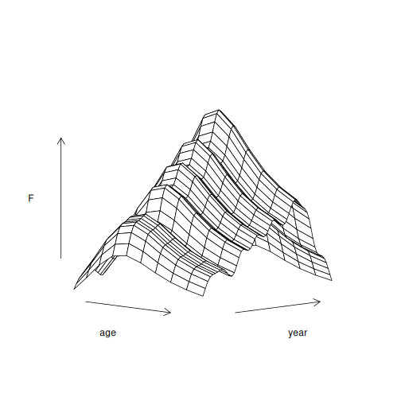
<p class="caption">Fishing mortality smoothed separable model</p>
</div>

A non-separable model, where we consider age and year to interact can be modeled using a smooth interaction term in the F model using a tensor product of cubic splines with the `te} method (\@ref(fig:te1)), again borrowed from [mgcv](http://cran.r-project.org/web/packages/mgcv/index.html).


``` r
fmod <- ~ te(age, year, k = c(4,20))
fit <- sca(ple4, ple4.indices[1], fmod, qmod, srmod)
```

<div class="figure" style="text-align: center">
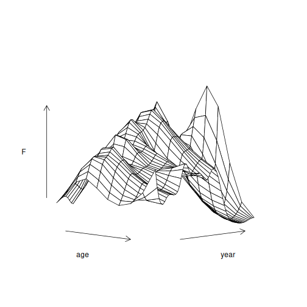
<p class="caption">Fishing mortality smoothed non-separable model</p>
</div>

In the last examples the fishing mortalities (Fs') are linked across age and time.  What if we want to free up a specific age class because in the residuals we see a consistent pattern.  This can happen, for example, if the spatial distribution of juveniles is disconnected to the distribution of adults.  The fishery focuses on the adult fish, and therefore the the F on young fish is a function of the distribution of the juveniles and could deserve a specific model. This can be achieved by adding a component for the year effect on age 1 (\@ref(fig:age1)).


``` r
fmod <- ~ te(age, year, k = c(4,20)) + s(year, k = 5, by = as.numeric(age==1))
fit <- sca(ple4, ple4.indices[1], fmod, qmod, srmod)
```

<div class="figure" style="text-align: center">
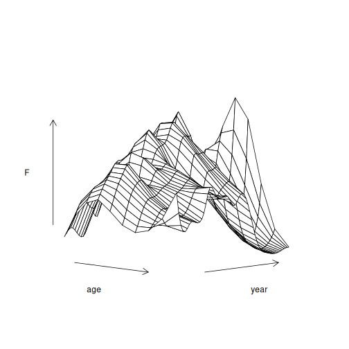
<p class="caption">Fishing mortality age-year interaction model with extra age 1 smoother.</p>
</div>

## Catchability submodel

The catchability submodel is set up the same way as the $F$ submodel and the tools available are the same. The only difference is that the submodel is set up as a list of formulas, where each formula relates with one abundance index.

We'll start by fixing the $F$ and $R$ models and compute the fraction of the year the index relates to, which will allow us to compute catchability at age and year.


``` r
fmod <- ~ factor(age) + factor(year)
srmod <- ~ factor(year)
```

A first model is simply a dummy effect on age, which means that a coefficient will be estimated for each age. Note that this kind of model considers that levels of the factor are independent (\@ref(fig:dummyage)).


``` r
qmod <- list(~ factor(age))
fit <- sca(ple4, ple4.indices[1], fmod, qmod, srmod)
```

To compute the catchability estimated for each index we'll need to compute the abundance at the moment the index was carried out and divide the predicted index by the abundance. More precisely we'll compute abundance in the mid of the index period, which is stored in the `FLIndex` object, in the slot `range`, in fractions of the year. Later we'll see that we can use the method `predict()` to get the same result, but we'll need a `a4aFitSA` object to get the fitted parameters.


``` r
# compute N for the fraction of the year the survey is carried out
sfrac <- mean(range(ple4.indices[[1]])[c("startf", "endf")])
# fraction of total mortality up to that moment
Z <- (m(ple4) + harvest(fit))*sfrac
lst <- dimnames(fit@index[[1]])
# survivors
lst$x <- stock.n(fit)*exp(-Z)
stkn <- do.call("trim", lst)
qhat <- index(fit)[[1]]/stkn
```

<div class="figure" style="text-align: center">
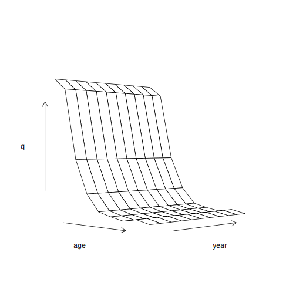
<p class="caption">Catchability age independent model</p>
</div>

If one considers catchability at a specific age to be dependent on catchability on the other ages, similar to a selectivity modelling approach, one option is to use a smoother at age, and let the data 'speak' regarding the shape (\@ref(fig:smoothage)).


``` r
qmod <- list(~ s(age, k=4))
fit <- sca(ple4, ple4.indices[1], fmod, qmod, srmod)

# compute N for the fraction of the year the survey is carried out
Z <- (m(ple4) + harvest(fit))*sfrac
lst <- dimnames(fit@index[[1]])
lst$x <- stock.n(fit)*exp(-Z)
stkn <- do.call("trim", lst)
qhat <- index(fit)[[1]]/stkn
```

<div class="figure" style="text-align: center">
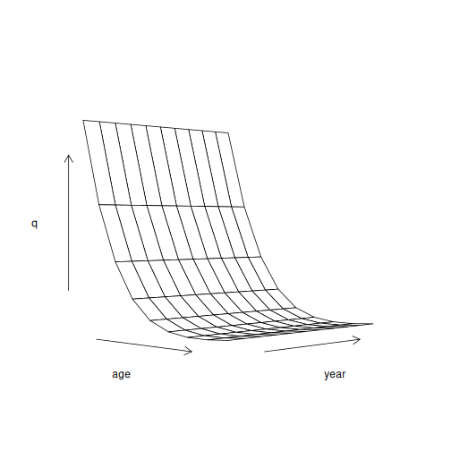
<p class="caption">Catchability smoother age model</p>
</div>

As in the case of $F$, one may consider catchability to be a process that evolves with age and year, including an interaction between the two effects. Such model can be modelled using the tensor product of cubic splines, the same way we did for the $F$ model (\@ref(fig:te2)).


``` r
qmod <- list(~ te(age, year, k = c(3,40)))
fit <- sca(ple4, ple4.indices[1], fmod, qmod, srmod)

# compute N for the fraction of the year the survey is carried out
Z <- (m(ple4) + harvest(fit))*sfrac
lst <- dimnames(fit@index[[1]])
lst$x <- stock.n(fit)*exp(-Z)
stkn <- do.call("trim", lst)
qhat <- index(fit)[[1]]/stkn
```

<div class="figure" style="text-align: center">
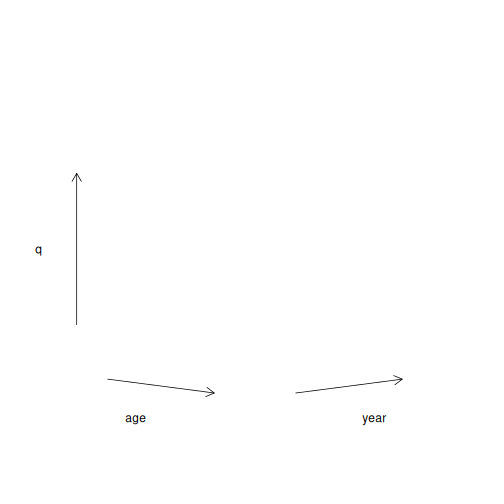
<p class="caption">Catchability tensor product of age and year</p>
</div>

Finally, one may want to investigate a trend in catchability with time, very common in indices built from CPUE data. In the example given here we'll use a linear trend in time, set up by a simple linear model (\@ref(fig:qtrend)).


``` r
qmod <- list( ~ s(age, k=4) + year)
fit <- sca(ple4, ple4.indices[1], fmod, qmod, srmod)

# compute N for the fraction of the year the survey is carried out
Z <- (m(ple4) + harvest(fit))*sfrac
lst <- dimnames(fit@index[[1]])
lst$x <- stock.n(fit)*exp(-Z)
stkn <- do.call("trim", lst)
qhat <- index(fit)[[1]]/stkn
```

<div class="figure" style="text-align: center">
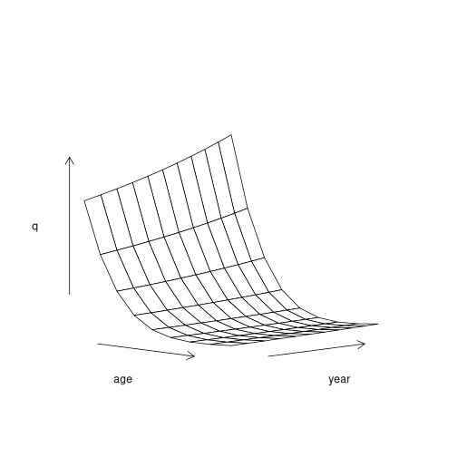
<p class="caption">Catchability with a linear trend in year</p>
</div>

## Catchability submodel for age aggregated indices

The previous section was focused on age disaggregated indices, but age aggregated indices (CPUE, biomass, DEPM, etc) may also be used to tune the total biomass of the population. In these cases a slightly different class for the index must be used, the `FLIndexBiomass`, which uses a vector `index` with the age dimension called "all". Note that in this case the qmodel should be set without age factors, although it can have a "year" component and covariates if needed. An interesting feature with biomass indices is the age range they refer to can be specified.


``` r
# simulating a biomass index (note the name of the first dimension element) using 
# the ple4 biomass and an arbritary catchability of 0.001 plus a lognormal error.
dnms <- list(age="all", year=range(ple4)["minyear"]:range(ple4)["maxyear"])
bioidx <- FLIndexBiomass(FLQuant(NA, dimnames=dnms))
index(bioidx) <- stock(ple4)*0.001
index(bioidx) <- index(bioidx)*exp(rnorm(index(bioidx), sd=0.1))
range(bioidx)[c("startf","endf")] <- c(0,0)

# note the name of the first dimension element
index(bioidx)
```

```
An object of class "FLQuant"
, , unit = unique, season = all, area = unique

     year
age   1957 1958 1959 1960 1961 1962 1963 1964 1965 1966 1967 1968 1969 1970
  all  383  450  397  545  498  620  556  659  508  607  647  532  509  446
     year
age   1971 1972 1973 1974 1975 1976 1977 1978 1979 1980 1981 1982 1983 1984
  all  430  445  410  398  441  500  562  457  464  456  353  559  617  572
     year
age   1985 1986 1987 1988 1989 1990 1991 1992 1993 1994 1995 1996 1997 1998
  all  587  799  667  631  631  619  571  482  367  442  297  290  374  382
     year
age   1999 2000 2001 2002 2003 2004 2005 2006 2007 2008 2009 2010 2011 2012
  all  334  359  346  372  379  425  353  399  402  502  592  754  731  730
     year
age   2013 2014 2015 2016 2017
  all  868 1055  769  927 1137

units:  t 
```

``` r
# fitting the model
fit <- sca(ple4, FLIndices(bioidx), qmodel=list(~1))
```

The same methods that are applied to age disaggregated indices apply here, see standardized log residuals in \@ref(fig:resbio). It's also possible to mix several indices of both types.

<div class="figure" style="text-align: center">
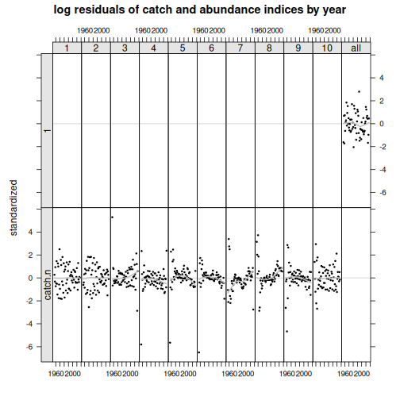
<p class="caption">Catchability residuals for a biomass index</p>
</div>

An example where the biomass index refers only to age 2 to 4 (for example a CPUE that targets these particular ages).


``` r
# creating the index
dnms <- list(age="all", year=range(ple4)["minyear"]:range(ple4)["maxyear"])
bioidx <- FLIndexBiomass(FLQuant(NA, dimnames=dnms))
# but now use only ages 2:4
index(bioidx) <- tsb(ple4[ac(2:4)])*0.001
index(bioidx) <- index(bioidx)*exp(rnorm(index(bioidx), sd=0.1))
range(bioidx)[c("startf","endf")] <- c(0,0)
# to pass this information to the model one needs to specify an age range
range(bioidx)[c("min","max")] <- c(2,4)

# fitting the model
fit <- sca(ple4, FLIndices(bioidx), qmodel=list(~1))
```

And once more residual plots as dignostics (\@ref(fig:resbio2)).

<div class="figure" style="text-align: center">
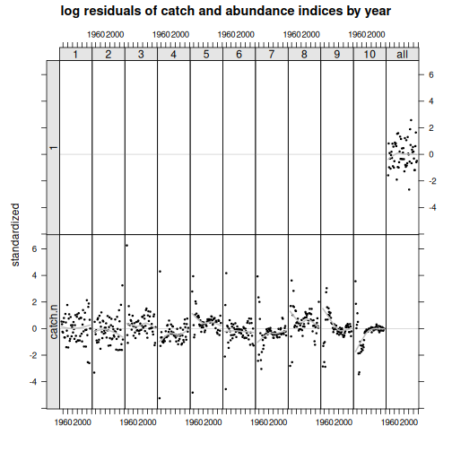
<p class="caption">Catchability residuals for a biomass index</p>
</div>

## Catchability submodel for single age indices

Similar to age aggregated indices one may have an index that relates only to one age, like a recruitment index. In this case the `FLIndex` object must have in the first dimension the age it referes to. The fit is then done relating the index with the proper age in numbers. Note that in this case the qmodel should be set without age factors, although it can have a "year" component and covariates if needed.


``` r
fit <- sca(ple4, FLIndices(ple4.index[1]), qmodel=list(~1))
```

As previously, the same methods apply, see standardized log residuals in \@ref(fig:resrec).

<div class="figure" style="text-align: center">
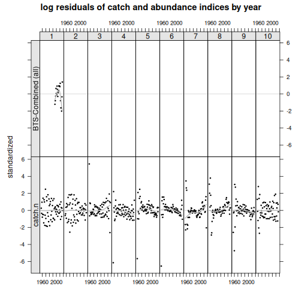
<p class="caption">Catchability residuals for a single age index</p>
</div>

## Stock-recruitment submodel

The S/R submodel is a special case, in the sense that it can be set up with the same linear tools as the $F$ and $Q$ models, but it can also use some hard coded models. The example shows how to set up a simple dummy model with `factor()`, a smooth model with `s()`, a Ricker model (`ricker()`), a Beverton and Holt model (`bevholt()`), a hockey stick model (`hockey()`), and a geometric mean model (`geomean()`). See \@ref(fig:srmod) for results. As mentioned before, the 'structural' models have a fixed variance, which must be set by defining the coefficient of variation. We now fix the $F$ and $Q$ submodels before fiddling around with the S/R model.


``` r
fmod <- ~ s(age, k=4) + s(year, k = 20)
qmod <- list(~ s(age, k=4))
```


``` r
srmod <- ~ factor(year)
fit <- sca(ple4, ple4.indices[1], fmod, qmod, srmod)
srmod <- ~ s(year, k=20)
fit1 <- sca(ple4, ple4.indices[1], fmod, qmod, srmod)
srmod <- ~ ricker(CV=0.1)
fit2 <- sca(ple4, ple4.indices[1], fmod, qmod, srmod)
srmod <- ~ bevholt(CV=0.1)
fit3 <- sca(ple4, ple4.indices[1], fmod, qmod, srmod)
srmod <- ~ hockey(CV=0.2)
fit4 <- sca(ple4, ple4.indices[1], fmod, qmod, srmod)
srmod <- ~ geomean(CV=0.1)
fit5 <- sca(ple4, ple4.indices[1], fmod, qmod, srmod)
```

<div class="figure" style="text-align: center">
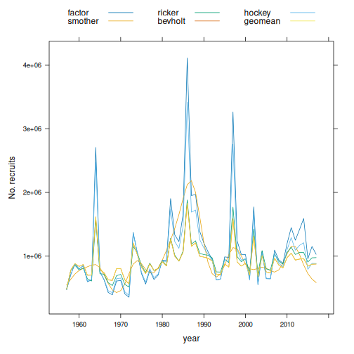
<p class="caption">Stock-recruitment models fits</p>
</div>

# The major effects - age, year and cohort

All submodels use the same type of specification process, the R formula interface, wich gives lot's of flexibility to explore models and combination of sub-models. As a reference one can consider three major effects that can be modelled the same way, the age affect, year effect and cohort effect. As examples note the following models, in these cases applied to fishing mortality, and all of them as a factor, which means one coefficient will be estimated for each level of the factor, meaning age, year or cohort respectively.


``` r
# the age effect
ageeffect <- ~ factor(age)

# the year effect
yeareffect <- ~ factor(year)

# the cohort
cohorteffect <- ~ factor(year-age)

# the fits
fit1 <- sca(ple4, ple4.indices, fmodel=yeareffect)
fit2 <- sca(ple4, ple4.indices, fmodel=ageeffect)
fit3 <- sca(ple4, ple4.indices, fmodel=cohorteffect)
```

and the graphical representation of the three models in Figures~\ref{fig:majeffy} to \ref{fig:majeffc}.

<div class="figure" style="text-align: center">
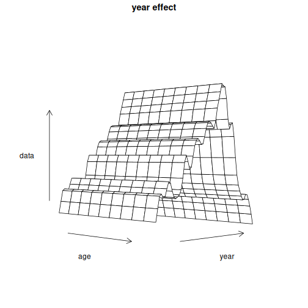
<p class="caption">Major effects: the year effect (~ factor(year))</p>
</div>

<div class="figure" style="text-align: center">
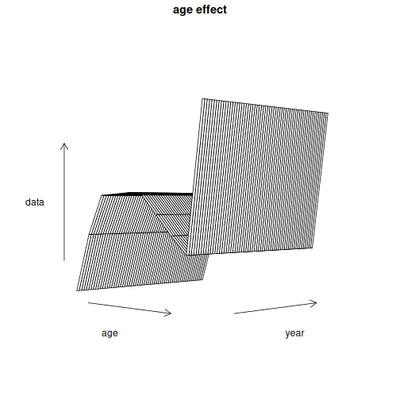
<p class="caption">Major effects: the age effect (~ factor(age))</p>
</div>

<div class="figure" style="text-align: center">
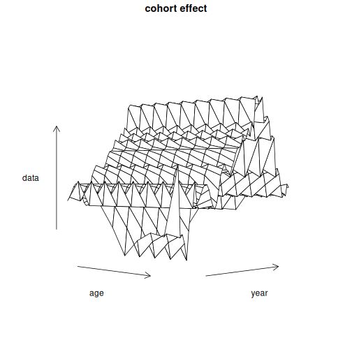
<p class="caption">Major effects: the cohort effect (~ factor(year-age))</p>
</div>

# The statistical catch-at-age stock assessment framework advanced features - the `a4aSCA` method

A more advanced method for stock assessment can be used through the `a4aSCA()` method. This method gives access to the submodels for $N1$, $\sigma^2_{ay}$ and $I_{ays}$ as well as arguments to get the ADMB files, etc. Check the manual pages with `?a4aSCA` for more information. This method has 'assessment' as the default value for the `fit} argument, which means that the hessian is going to be computed and all the information about the parameters will be returned by default. Note that the default models of each submodel can be accessed with


``` r
fit <- a4aSCA(ple4, ple4.indices[1])
```

```
Error in a4aSCA(ple4, ple4.indices[1]): The method "a4aSCA" was removed, please use "sca", which now gives the user assess to the same arguments "a4aSCA".
```

``` r
submodels(fit)
```

```
	 fmodel: ~s(age, k = 4) + s(year, k = 20)
	srmodel: ~factor(year)
	n1model: ~s(age, k = 3)
	 qmodel:
	   BTS-Isis-early: ~s(age, k = 4)
	 vmodel:
	   catch:          ~s(age, k = 3)
	   BTS-Isis-early: ~1
```

## N1 model

The submodel for the stock number at age in the first year of the time series is set up with the usual linear tools (\@ref(fig:ny1)), but bare in mind that the year effect does not make sense here.


``` r
n1mod <- ~s(age, k=4)
fit1 <- a4aSCA(ple4, ple4.indices[1], n1model=n1mod)
```

```
Error in a4aSCA(ple4, ple4.indices[1], n1model = n1mod): The method "a4aSCA" was removed, please use "sca", which now gives the user assess to the same arguments "a4aSCA".
```

``` r
flqs <- FLQuants(smother=stock.n(fit1)[,1], factor=stock.n(fit)[,1])
```

<div class="figure" style="text-align: center">
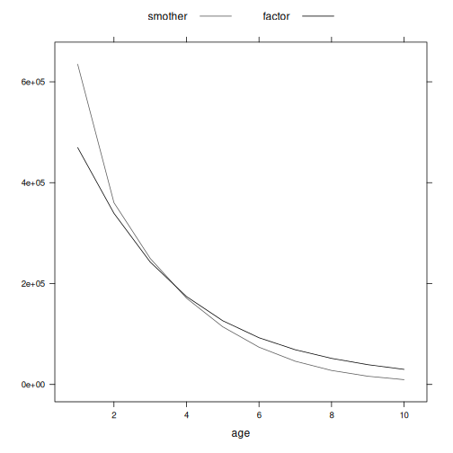
<p class="caption">Nay=1 models</p>
</div>

## Variance model

The variance model allows the user to set up the shape of the observation variances $\sigma^2_{ay}$ and $I_{ays}$. This is an important subject related with fisheries data used for input to stock assessment models. It's quite common to have more precision on the most represented ages and less precision on the less frequent ages. This is due to the fact that the last ages do not appear as often at the auction markets, in the fishing operations or on survey samples.

By default the model assumes constant variance over time and ages (~ 1 model) but it can use other models specified by the user. As with the other submodels, R linear model capabilities are used (\@ref(fig:varmod)).


``` r
vmod <- list(~1, ~1)
fit1 <- a4aSCA(ple4, ple4.indices[1], vmodel=vmod)
```

```
Error in a4aSCA(ple4, ple4.indices[1], vmodel = vmod): The method "a4aSCA" was removed, please use "sca", which now gives the user assess to the same arguments "a4aSCA".
```

``` r
vmod <- list(~ s(age, k=4), ~1)
fit2 <- a4aSCA(ple4, ple4.indices[1], vmodel=vmod)
```

```
Error in a4aSCA(ple4, ple4.indices[1], vmodel = vmod): The method "a4aSCA" was removed, please use "sca", which now gives the user assess to the same arguments "a4aSCA".
```

``` r
flqs <- FLQuants(cts=catch.n(fit1), smo=catch.n(fit2))
```

<div class="figure" style="text-align: center">
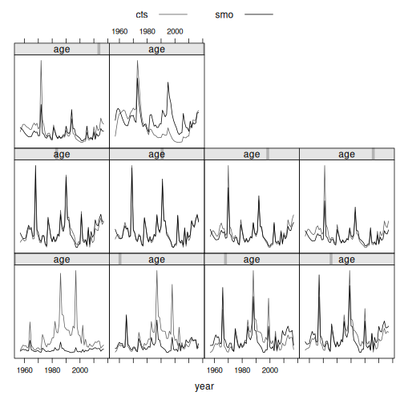
<p class="caption">Population estimates using two different variance models</p>
</div>

## Working with covariates

In linear model one can use covariates to explain part of the variance observed on the data that the 'core' model does not explain. The same can be done in the a4a framework. The example below uses the North Atlantic Oscillation (NAO) index to model recruitment.


``` r
nao <- read.table("https://www.esrl.noaa.gov/psd/data/correlation/nao.data", skip=1,
                  nrow=62, na.strings="-99.90")
dnms <- list(quant="nao", year=1948:2009, unit="unique", season=1:12, area="unique")
nao <- FLQuant(unlist(nao[,-1]), dimnames=dnms, units="nao")
nao <- seasonMeans(trim(nao, year=dimnames(stock.n(ple4))$year))
```

```
Error in (function (cond) : error in evaluating the argument 'x' in selecting a method for function 'seasonMeans': subscript out of bounds
```

``` r
nao <- as.numeric(nao)
```

First by simply assuming that the NAO index drives recruitment (\@ref(fig:naor)).


``` r
srmod <- ~ nao
fit2 <- sca(ple4, ple4.indices[1], qmodel=list(~s(age, k=4)), srmodel=srmod)
```

```
Error in .local(object, ...): something went wrong - check for NAs in covariates
```

``` r
flqs <- FLQuants(simple=stock.n(fit)[1], covar=stock.n(fit2)[1])
```

<div class="figure" style="text-align: center">
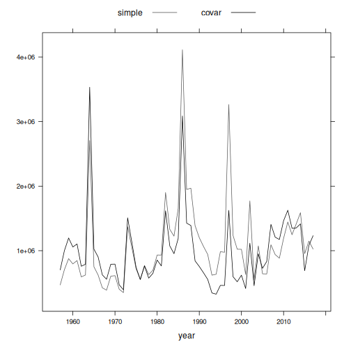
<p class="caption">Recruitment model with covariates. Using the NAO index as a recruitment index.</p>
</div>

In a second model we're using the NAO index not to model recruitment directly but to model one of the parameters of the S/R function (\@ref(fig:naor2)).


``` r
srmod <- ~ ricker(a=~nao, CV=0.1)
fit3 <- sca(ple4, ple4.indices[1], qmodel=list(~s(age, k=4)), srmodel=srmod)
```

```
Error in .local(object, ...): something went wrong - check for NAs in covariates
```

``` r
flqs <- FLQuants(simple=stock.n(fit)[1], covar=stock.n(fit3)[1])
```

<div class="figure" style="text-align: center">
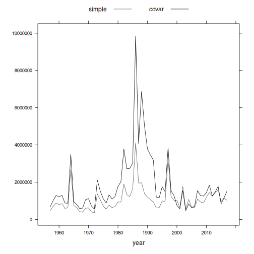
<p class="caption">Recruitment model with covariates. Using the NAO index as a covariate for the stock-recruitment model parameters.</p>
</div>

Note that covariates can be added to any submodel using the linear model capabilities of R.

## Assessing ``ADMB`` files

The framework gives access to the files produced to run the ``ADMB`` fitting routine through the argument `wkdir`. When set up all the ``ADMB`` files will be left in the directory. Note that the ``ADMB`` tpl file is distributed with the ``FLa4a``. One can get it from your ``R`` library, under the folder `myRlib/FLa4a/admb/`.


``` r
fit1 <- a4aSCA(ple4, ple4.indices, wkdir="fit1run")
```

# Predict and simulate

To predict and simulate ``R`` uses the methods `predict()` and `simulate()`, which were implemented in ``FLa4a`` in the same fashion.


``` r
fit <- sca(ple4, ple4.indices[1], fit="assessment")
```

## Predict

Predict simply computes the quantities of interest using the estimated coefficients and the design matrix of the model.


``` r
fit.pred <- predict(fit)
lapply(fit.pred, names)
```

```
$stkmodel
[1] "harvest" "rec"     "ny1"    

$qmodel
[1] "BTS-Isis-early"

$vmodel
[1] "catch"          "BTS-Isis-early"
```

## Simulate

Simulate uses the variance-covariance matrix computed from the Hessian returned by ``ADMB`` and the fitted parameters, to parametrize a multivariate normal distribution. The simulations are carried out using the method `mvrnorm()` provided by the R package [MASS](http://cran.r-project.org/web/packages/MASS/). \@ref(fig:sim) shows a comparison between the estimated values and the medians of the simulation, while \@ref(fig:sim2) presents the stock summary of the simulated and fitted data.


``` r
fits <- simulate(fit, 100)
flqs <- FLQuants(sim=iterMedians(stock.n(fits)), det=stock.n(fit))
```

<div class="figure" style="text-align: center">
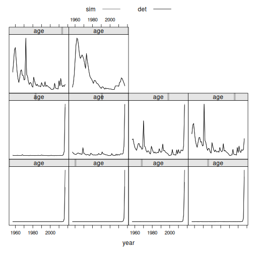
<p class="caption">Median simulations VS fit</p>
</div>

<div class="figure" style="text-align: center">
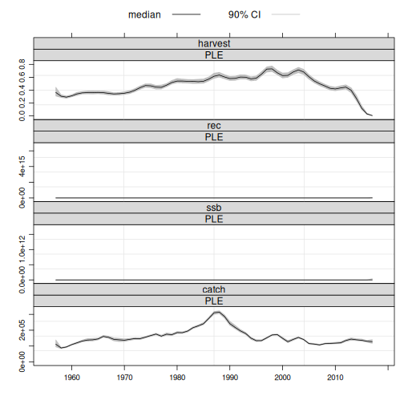
<p class="caption">Stock summary of the simulated and fitted data</p>
</div>

# The statistical catch-at-age stock assessment framework with MCMC

The previous methods were demonstrated using the maximum likelihood estimation method. However, `ADMB` can also use MCMC methods to fit the model. This section shows how the `sca` and `a4aSCA` methods interface with ADMB to use the MCMC fits.

The likelihood estimate is


``` r
# ll
fit <- a4aSCA(ple4, ple4.indices)
```

```
Error in a4aSCA(ple4, ple4.indices): The method "a4aSCA" was removed, please use "sca", which now gives the user assess to the same arguments "a4aSCA".
```

``` r
fit <- simulate(fit, 1000)
```

To run the MCMC estimate, one needs to configure a set of arguments, which is done by creating a `SCAMCMC` object. For details on the MCMC configuration in ``ADMB`` visit the ADMB website.


``` r
# mcmc
mc <- SCAMCMC()
# check the default pars
mc
```

```
An object of class "SCAMCMC"
Slot "mcmc":
[1] 10000

Slot "mcsave":
[1] 100

Slot "mcscale":
[1] NaN

Slot "mcmult":
[1] NaN

Slot "mcrb":
[1] NaN

Slot "mcprobe":
[1] NaN

Slot "mcseed":
[1] NaN

Slot "mcdiag":
[1] FALSE

Slot "mcnoscale":
[1] FALSE

Slot "mcu":
[1] FALSE

Slot "hybrid":
[1] FALSE

Slot "hynstep":
[1] NaN

Slot "hyeps":
[1] NaN
```

Defaults for now are ok, so lets fit the model. Note that the argument `fit` ius set to *MCMC* and the argument `mcmc` takes the `SCAMCMC` object. A major check when running MCMC is the acceptance rate, which should be around 0.3. This is a rule of thumb, for more information read the (extensive) literature on MCMC. The slot `fitSumm` stores that information.


``` r
# fit the model
fitmc1 <- a4aSCA(ple4, ple4.indices, fit="MCMC", mcmc=mc)
```

```
Error in a4aSCA(ple4, ple4.indices, fit = "MCMC", mcmc = mc): The method "a4aSCA" was removed, please use "sca", which now gives the user assess to the same arguments "a4aSCA".
```

``` r
# check acceptance rate
fitSumm(fitmc1)
```

```
Error in h(simpleError(msg, call)): error in evaluating the argument 'object' in selecting a method for function 'fitSumm': object 'fitmc1' not found
```

We use the package `CODA` to run the diagnostics on MCMC fits. First one can plot chains using coda. Note the mcmc object is a matrix with the parameters (row = iters, cols= pars).


``` r
fitmc1.mc <- as.mcmc(fitmc1)
plot(fitmc1.mc)
```

The usual summary plot,


```
Error in h(simpleError(msg, call)): error in evaluating the argument 'x' in selecting a method for function 'plot': object 'fitmc1' not found
```

As mentioned above ``ADMB`` has several options for MCMC. Here we demonstrate one of them, `mcprobe` which sets a fat-tailed proposal distribution, as an example of how to use the `SCAMCMC` objects.


``` r
mc <- SCAMCMC(mcmc=10000, mcsave=200, mcprobe=0.4)
fitmc2 <- a4aSCA(ple4, ple4.indices, qmodel=list(~s(age, k=3), ~s(age, k=3),~s(age, k=3)), fit="MCMC", mcmc=mc)
```

```
Error in a4aSCA(ple4, ple4.indices, qmodel = list(~s(age, k = 3), ~s(age, : The method "a4aSCA" was removed, please use "sca", which now gives the user assess to the same arguments "a4aSCA".
```

All fits together


```
Error in h(simpleError(msg, call)): error in evaluating the argument 'x' in selecting a method for function 'plot': object 'fitmc1' not found
```

# Geeky stuff

A lot more can be done with the a4a framework. The next sections will describe methods that are more technical. What we'd categorize as 'matters for geeks', in the sense that these methods usually will require the users to 'dive' into **R** a bit more.


``` r
fit <- sca(ple4, ple4.indices[1], fit="assessment")
```

## External weigthing of likelihood components

By default the likelihood components are weighted using inverse variance. However, the user may change the weights by setting the variance of the input parameters. This is done by adding a variance matrix to the `catch.n` and `index.n` slots of the stock and index objects. These variances will be used to penalize the data during the likelihood computation. The values should be given as coefficients of variation on the log scale, so that variance is $\log{({CV}^2 + 1)}$. \@ref(fig:likwgt) shows the results of two fits with distinct likelihood weightings.


``` r
stk <- ple4
idx <- ple4.indices[1]
# variance of observed catches
varslt <- catch.n(stk)
varslt[] <- 0.4
catch.n(stk) <- FLQuantDistr(catch.n(stk), varslt)
# variance of observed indices
varslt <- index(idx[[1]])
varslt[] <- 0.1
index.var(idx[[1]]) <- varslt
# run
fit1 <- a4aSCA(stk, idx)
```

```
Error in a4aSCA(stk, idx): The method "a4aSCA" was removed, please use "sca", which now gives the user assess to the same arguments "a4aSCA".
```

``` r
flqs <- FLQuants(nowgt=stock.n(fit), extwgt=stock.n(fit1))
```

<div class="figure" style="text-align: center">
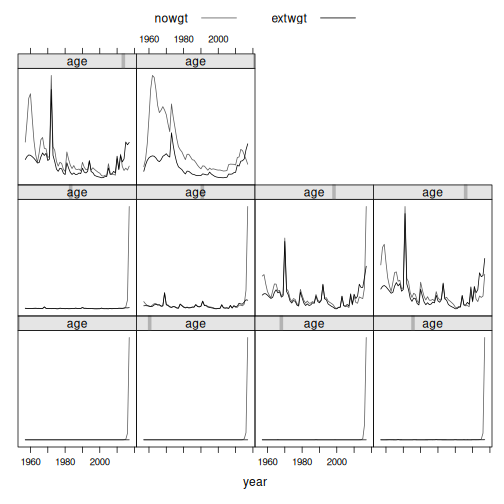
<p class="caption">Stock summary of distinct likelihood weightings</p>
</div>

## More models

There's a set of methods that allow the user to have more flexibility on applying the models referred before. For example to break the time series in two periods, using the method `breakpts()`, or fixing some parts of the selection pattern by setting F to be the same for a group of ages, using `replace()`.

The example below (\@ref(fig:rep)) replaces all ages above 5 by age 5, which means that a single coefficient is going to be estimated for age 5-10.


``` r
fmod <- ~ s(replace(age, age>5, 5), k=4) + s(year, k=20)
fit <- sca(ple4, ple4.indices, fmod)
```

<div class="figure" style="text-align: center">
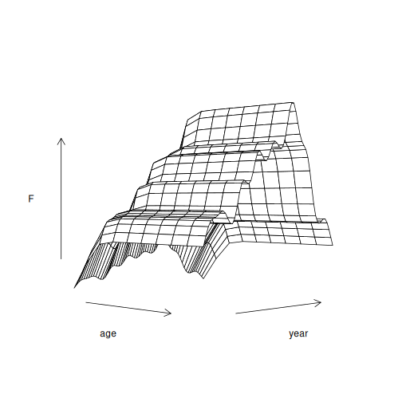
<p class="caption">F-at-age fixed above age 5</p>
</div>

Or else one can use a closed form fort the selection pattern. The example below uses a logistic form (\@ref(fig:logistic)).


``` r
fmod <- ~ I(1/(1+exp(-age)))
fit <- sca(ple4, ple4.indices, fmod)
```

<div class="figure" style="text-align: center">
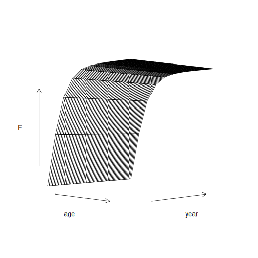
<p class="caption">F-at-age logistic</p>
</div>

In the next case we'll use the `breakpts()` to split the time series at 1990, although keeping the same shape in both periods, a thin plate spline with 3 knots (\@ref(fig:brk)).


``` r
fmod <- ~s(age, k = 3, by = breakpts(year, 1990))
fit <- sca(ple4, ple4.indices, fmod)
```

<div class="figure" style="text-align: center">
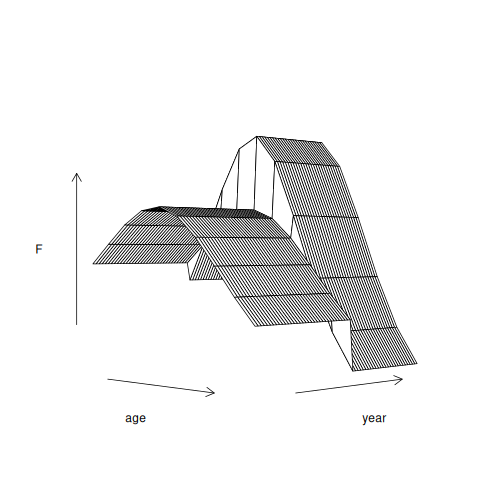
<p class="caption">F-at-age in two periods using in both cases a thin plate spline with 3 knots</p>
</div>

More complicated models can be built with these tools. For example, \@ref(fig:ageind) shows a model where the age effect is modelled as a smoother (the same thin plate spline) throughout years but independent from each other.


``` r
fmod <- ~ factor(age) + s(year, k=10, by = breakpts(age, c(2:8)))
fit <- sca(ple4, ple4.indices, fmod)
```

<div class="figure" style="text-align: center">
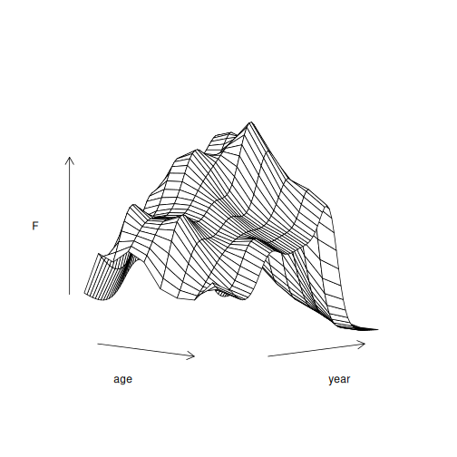
<p class="caption">F-at-age as thin plate spline with 3 knots for each age</p>
</div>

A quite complex model that implements a cohort effect can be set through the following formula. \@ref(fig:coh) shows the resulting fishing mortality. Note that in this case we end up with a variable F pattern over time, but rather than using 4 * 10 = 40 parameters, it uses, 4 + 10 + 10 = 24.


``` r
fmodel <- ~ s(age, k = 4) + s(pmax(year - age, 1957), k = 10) + s(year, k = 10)
fit <- sca(ple4, ple4.indices, fmodel=fmodel)
```

<div class="figure" style="text-align: center">
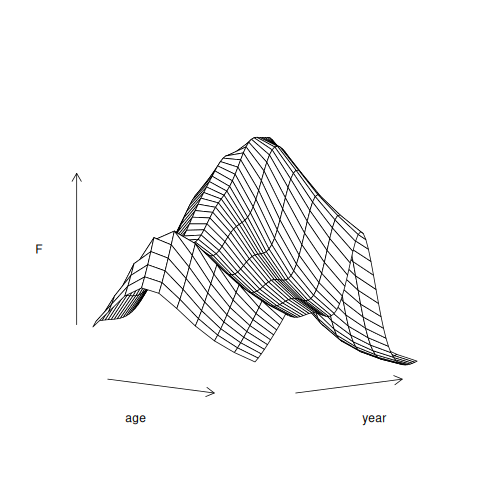
<p class="caption">F-at-age with a cohort effect.</p>
</div>

## Propagate natural mortality uncertainty

In this section we give an example of how uncertainty in natural mortality, set up using the `m()` method and the class `a4aM` (see `vignette("M")`), is propagated through the stock assessment. We'll start by fitting the default model to the data.


``` r
data(ple4)
data(ple4.indices)
fit <- sca(ple4, ple4.indices)
```

Using the a4a methods we'll model natural mortality using a negative exponential model by age, Jensen's estimator for the level and a constant trend with time. We include multivariate normal uncertainty using the `mvrnorm()` method and create 25 iterations.


``` r
nits <- 25

shape <- FLModelSim(model=~exp(-age-0.5))
level <- FLModelSim(model=~k^0.66*t^0.57, params = FLPar(k=0.4, t=10),
                    vcov=matrix(c(0.002, 0.01,0.01, 1), ncol=2))
trend <- FLModelSim(model=~b, params=FLPar(b=0.5), vcov=matrix(0.02))

m4 <- a4aM(shape=shape, level=level, trend=trend)
m4 <- mvrnorm(nits, m4)
range(m4)[] <- range(ple4)[]
range(m4)[c("minmbar","maxmbar")]<-c(1,1)
flq <- m(m4)[]
quant(flq) <- "age"
stk <- propagate(ple4, nits)
m(stk) <- flq
```

We fit the same model to the new stock object which has uncertainty in the natural mortality. The assessment is performed for each of the 25 iterations.


``` r
fit1 <- sca(stk, ple4.indices)
```

And compare the two results (\@ref(fig:mprop)). It's quite easy to run these kind of tests and a large part of our effort is to create the tools to do so.

<div class="figure" style="text-align: center">
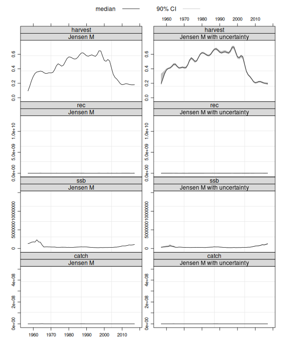
<p class="caption">Stock summary for two M models</p>
</div>

## WCSAM exercise - replicating itself

The World Conference on Stock Assessment Methods [WCSAM](\href{http://www.ices.dk/news-and-events/symposia/WCSAM-2013) promoted a workshop where a large simulation study was used to test the performance of distinct stock assessment models. The first criteria used was that the models should be able to reproduce itself. The process involved fitting the model, simulating observation error using the same model, and refitting the model to each iteration. The final results should be similar to the fitted results before observation error was added (see [Deroba, et.al, 2014](http://icesjms.oxfordjournals.org/content/early/2014/01/18/icesjms.fst237.abstract) for details). The following analysis runs this analysis and \@ref(fig:wcsam) presents the results.


``` r
# number of iters
nits <- 25
# fit the model
fit <- a4aSCA(ple4, ple4.indices[1])
```

```
Error in a4aSCA(ple4, ple4.indices[1]): The method "a4aSCA" was removed, please use "sca", which now gives the user assess to the same arguments "a4aSCA".
```

``` r
# update the stock data
stk <- ple4 + fit
# simulate controlling the random seed
fits <- simulate(fit, nits, 1234)
# update stock and index data, now with iters
stks <- ple4 + fits
idxs <- ple4.indices[1]
index(idxs[[1]]) <- index(fits)[[1]]
# run assessments on each iter
sfit <- a4aSCA(stks, idxs, fit="MP")
```

```
Error in a4aSCA(stks, idxs, fit = "MP"): The method "a4aSCA" was removed, please use "sca", which now gives the user assess to the same arguments "a4aSCA".
```


```
Error in h(simpleError(msg, call)): error in evaluating the argument 'x' in selecting a method for function 'plot': object 'sfit' not found
```

## Parallel computing

This is an example of how to use the **parallel** R package to run assessments. In this example each iteration is a dataset, including surveys, and we'll run one assessment for each iteration. Afterwards the data is pulled back together in an `FLStock` object and plotted (\@ref(fig:wcsampar)). Only 20 iterations are run to avoid taking too long. Also note that we're using 4 cores. This parameter depends on the computer being used. These days almost all computers have at least 2 cores.

Finally, compare this code with the one for replicating WCSAM and note that it's exactly the same, except that we're using `mclapply()` from package ``paralell`` instead of `lapply()`.


``` r
data(ple4)
data(ple4.indices)
nits <- 25
fit <- a4aSCA(ple4, ple4.indices[1])
```

```
Error in a4aSCA(ple4, ple4.indices[1]): The method "a4aSCA" was removed, please use "sca", which now gives the user assess to the same arguments "a4aSCA".
```

``` r
stk <- ple4 + fit
fits <- simulate(fit, nits, 1234)
stks <- ple4 + fits
idxs <- ple4.indices[1]
index(idxs[[1]]) <- index(fits)[[1]]
library(parallel)
lst <- mclapply(split(1:nits, 1:nits), function(x){
	out <- try(a4aSCA(iter(stks, x), FLIndices(iter(idxs[[1]], x)), fit="MP"))
	if(is(out, "try-error")) NULL else out
})
```

```
Error in a4aSCA(iter(stks, x), FLIndices(iter(idxs[[1]], x)), fit = "MP") : 
  The method "a4aSCA" was removed, please use "sca", which now gives the user assess to the same arguments "a4aSCA".
```

``` r
stks2 <- stks
for(i in 1:nits){
	iter(catch.n(stks2), i) <- catch.n(lst[[i]])
	iter(stock.n(stks2), i) <- stock.n(lst[[i]])
	iter(harvest(stks2), i) <- harvest(lst[[i]])
}
```

```
Error: unable to find an inherited method for function 'catch.n' for signature 'object = "NULL"'
```

``` r
catch(stks2) <- computeCatch(stks2)
stock(stks2) <- computeStock(stks2)
stks3 <- FLStocks(original=stk, simulation=stks, "fit over simulation"=stks2)
```

<div class="figure" style="text-align: center">
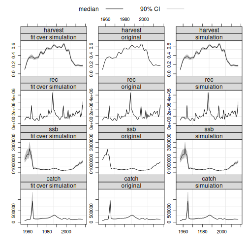
<p class="caption">Replicating the stock assessment model (WCSAM approach) using parallel computing</p>
</div>

# References


# More information

Documentation can be found at (http://flr-project.org/FLa4a). You are welcome to:

- Submit suggestions and bug-reports at: (https://github.com/flr/FLa4a/issues)
- Send a pull request on: (https://github.com/flr/FLa4a/)
- Compose a friendly e-mail to the maintainer, see `packageDescription('FLa4a')`

## Software Versions

* R version 4.5.0 (2025-04-11)
* FLCore: 2.6.20.9340
* FLa4a: 1.9.5
* **Compiled**: Tue Aug 26 17:17:23 2025

## License

This document is licensed under the [Creative Commons Attribution-ShareAlike 4.0 International](https://creativecommons.org/licenses/by-sa/4.0) license.

## Author information

**Ernesto Jardim**. European Commission, DG Joint Research Centre, Directorate D - Sustainable Resources, Unit D.02 Water and Marine Resources, Via E. Fermi 2749, 21027 Ispra VA, Italy. <https://ec.europa.eu/jrc/>
